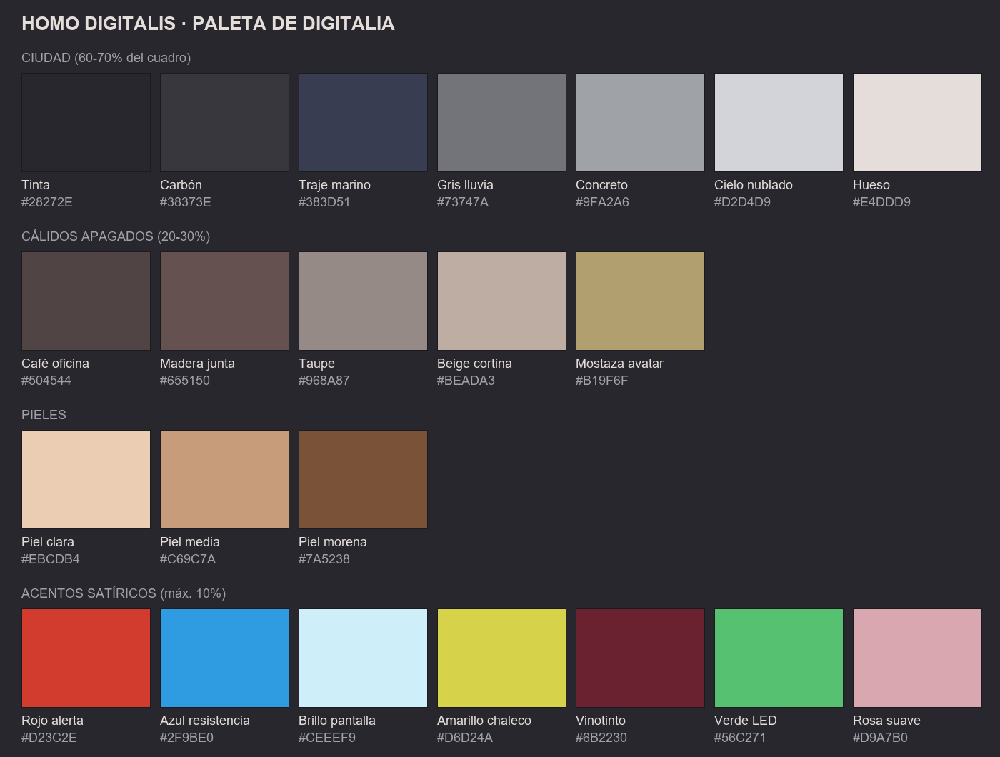

# Paleta de colores

Extraída de las imágenes de referencia (cuantización de todos los personajes y locaciones) y ajustada a mano.

## Regla 70 / 20 / 10
- **70 % ciudad:** grises fríos y azul marino. Es la atmósfera.
- **20 % cálidos apagados:** maderas, beiges, pieles. Hacen humanos los interiores.
- **10 % acento satírico:** el color va **solo donde está el chiste** (el +40 % rojo, el pelo azul, el logo de Moogle, los ojos rojos de los agentes, el brillo del celular).

## Ciudad
| Nombre | HEX | Uso |
|---|---|---|
| Tinta | `#28272E` | Líneas, sombras profundas, tarjeta final |
| Carbón | `#38373E` | Torres, escenarios, noche |
| Traje marino | `#383D51` | Trajes (Larry, Wilson, Mauricio, Andrés) |
| Gris lluvia | `#73747A` | Edificios, asfalto |
| Concreto | `#9FA2A6` | Paredes, andenes |
| Cielo nublado | `#D2D4D9` | Cielo de día (siempre nublado) |
| Hueso | `#E4DDD9` | Camisas blancas, robot, papel |

## Cálidos apagados
| Nombre | HEX | Uso |
|---|---|---|
| Café oficina | `#504544` | Muebles, pisos |
| Madera junta | `#655150` | Mesa de juntas Blakrok |
| Taupe | `#968A87` | Paredes interiores |
| Beige cortina | `#BEADA3` | Cortinas, suéteres, sábanas |
| Mostaza avatar | `#B19F6F` | Fondo del avatar, cojines |

## Pieles (referencia)
`#EBCDB4` clara · `#C69C7A` media · `#7A5238` morena. Siempre ligeramente desaturadas.

## Acentos satíricos (máx. 10 %)
| Nombre | HEX | Dónde aparece |
|---|---|---|
| Rojo alerta | `#D23C2E` | Precios (+40 %), ojos de agentes, furia, "Ciudadano no verificado" |
| Azul resistencia | `#2F9BE0` | Pelo azul de manifestantes, marca Blakrok de tinturas |
| Brillo pantalla | `#CEEEF9` | Luz de celulares en caras, ojos del robot |
| Amarillo chaleco | `#D6D24A` | Chaleco del alcalde, señalización |
| Vinotinto | `#6B2230` | Labios de Valentina, vino, sillas de restaurante |
| Verde LED | `#56C271` | LED del robot, gráficas de acciones subiendo |
| Rosa suave | `#D9A7B0` | Camiseta de Zuri, pijama de Yesenia |

Las banderas arcoíris y el logo de Moogle usan sus colores propios, pero **un punto más desaturados** que en la vida real.
