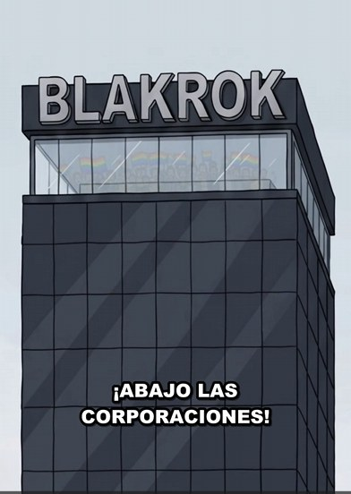

# Organizaciones y marcas parodia

Todas son parodias evidentes. **Nunca usar logos ni nombres reales.**

## Blakrok

Fondo de inversión dueño de casi todo en Digitalia (parodia de BlackRock). Torre negra de vidrio con letras 3D. Tiene su propia seguridad: los **Agentes de Verificación**, que persiguen a los ciudadanos sin datos.
- Dirige: [Larry Finque](../03-personajes/el-capitalista/ficha.md) · Junta: [Los Socios](../03-personajes/los-socios/ficha.md) · CM: [Sebas](../03-personajes/el-gay/ficha.md)
- Es dueño de: Moogle, Xpacio, Tervonx, Matchi, la empresa de tinturas de pelo (desde EP003). Financia la campaña del alcalde.
- Gag recurrente: en junio pone su logo arcoíris; en la marcha, las banderas también son suyas.

## Moogle

Gigante tecnológico (parodia de Google). Letras de colores gastadas. Lema en la fachada: **"AQUÍ SOMOS FAMILIA S.A.S."**
- Gerente regional: [Mauricio Sinergia](../03-personajes/el-empresario/ficha.md) · Ex empleado: [Wilson Pérez](../03-personajes/el-asalariado/ficha.md)

## Xpacio

Robots humanoides y cohetes (parodia de Tesla/SpaceX). Logo: **anillo segmentado + cohete**. Serie de robots domésticos: **Unidad**.
- CEO: [Elón Mosca](../03-personajes/el-ceo-tech/ficha.md) · Ingeniero real: [Marlon Mosquera](../03-personajes/el-negro/ficha.md) · Producto estrella: [Unidad‑7](../03-personajes/el-robot/ficha.md)

## Tervonx

Petrolera y cadena de gasolineras. Sube el precio +40 % sin aviso.
- Bombero: [Jhon Fredy](../03-personajes/el-bombero/ficha.md) · Accionista: [Andrés "El Bull"](../03-personajes/el-inversionista/ficha.md)

## Matchi

App de citas. Filtros de "preferencias": *Sin Android (solo iPhone) · Tiene carro · Le gusta viajar · Ingresos altos*. Notificación: "La aplicación ha actualizado tus preferencias de pareja".
- Usuaria premium: [Valentina](../03-personajes/la-mujer-empoderada/ficha.md)

## Gobierno de Digitalia

La Alcaldía. Especialista en primeras piedras.
- Alcalde: [Hernán Primera Piedra](../03-personajes/el-alcalde/ficha.md) · Asesor: [Toño El Grande](../03-personajes/el-enano/ficha.md) · Rival: [Senador Promesas](../03-personajes/el-politico/ficha.md)

---
### Ideas de marcas futuras
- **LinkedOut** — red profesional donde todos están "emocionados por nuevos retos".
- **Rappiflash / Domiciliarios** — delivery que te trae hasta la opinión.
- **Canal DN (Digitalia Noticias)** — noticiero que lee tuits.
- **Starbocks** — café donde se escribe el nombre mal a propósito para que lo publiques.
