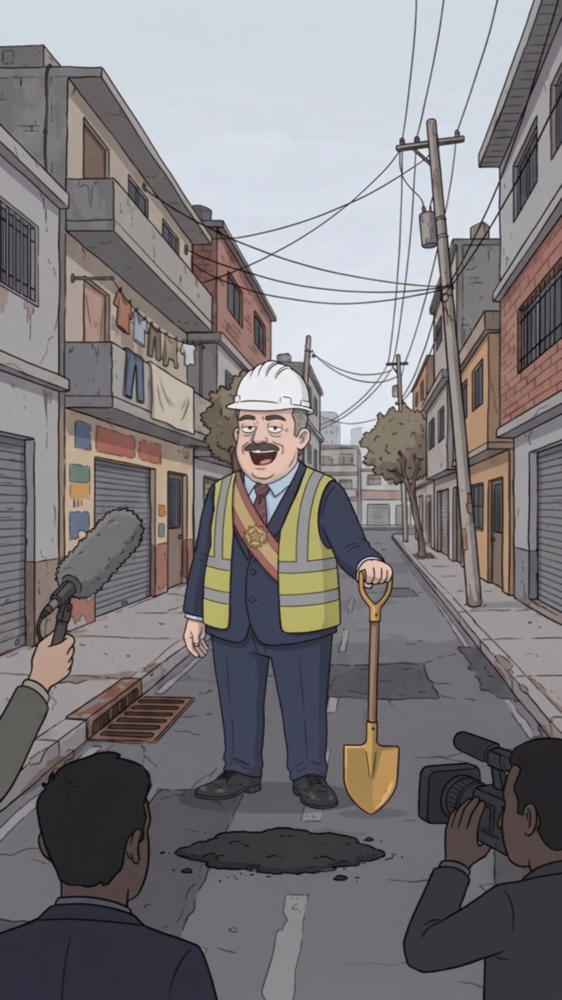

# Alcalde Hernán Primera Piedra

> **Arquetipo:** El alcalde  ·  **Estado:** 🟡 Diseñado (tiene imagen, sin episodio)



## Ficha
| | |
|---|---|
| **Edad** | 58 |
| **Oficio** | Alcalde de Digitalia (tercer periodo "no consecutivo"). |
| **Quiere** | La foto de la inauguración (y la reelección). |
| **Teme** | Terminar una obra: se acaba el show. |
| **Frase típica** | "Hoy ponemos la primera piedra de la primera piedra." |
| **Temas que satiriza** | `politica-show`, `abandono-estatal` |

## Personalidad
Inaugura todo, termina nada. Vive para la foto con la pala dorada. Habla en superlativos ("obra histórica", "sin precedentes"). Cree sinceramente que un bache inaugurado es un logro.

## Diseño visual
Robusto, bigote negro espeso, pelo canoso, casco blanco de obra, chaleco reflectivo amarillo SOBRE traje azul marino, banda de alcalde con medalla, pala dorada de inauguraciones.

**Prompt de consistencia** (pegar después del [prompt base de estilo](../../01-estilo-visual/prompts-base.md)):
```
chubby Latin American mayor in his late 50s, thick black mustache, white hard hat, yellow reflective safety vest over a navy suit, red-and-gold mayor sash with medal, holding a golden ceremonial shovel, big proud grin
```

## Relaciones
_Fuente de verdad: [05-grafo/grafo.json](../../05-grafo/grafo.json). Si cambias algo aquí, cámbialo también allá._

- → `dirige` [Gobierno de Digitalia](../../02-mundo/organizaciones.md#gobierno-digitalia)
- → `rivalidad` [Senador Octavio Promesas](../../03-personajes/el-politico/ficha.md) — elecciones
- ← [Antonio "Toño El Grande" Giraldo](../../03-personajes/el-enano/ficha.md) `asesora`
- → `conflicto` [Don Ubaldo](../../03-personajes/don-ubaldo/ficha.md) — quiere tapar el bache para la foto
- → `frecuenta` [Calle del Bache (Barrio La Esperanza)](../../04-locaciones/calle-del-bache/ficha.md) — inauguraciones
- → `trabaja_en` [Edificio de la Alcaldía](../../04-locaciones/alcaldia/ficha.md)

## Episodios
- Ninguno todavía.

## Notas / ideas pendientes
-
