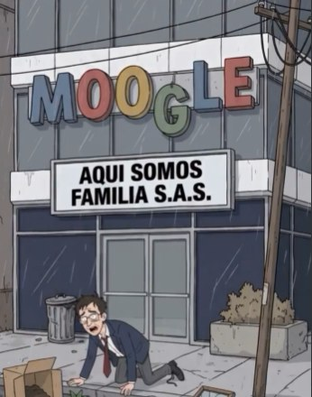

# Wilson Pérez

> **Arquetipo:** El típico asalariado  ·  **Estado:** 🟢 Canon (ya salió en un episodio)



## Ficha
| | |
|---|---|
| **Edad** | 34 |
| **Oficio** | Ex analista de Moogle. Actualmente "abierto a nuevos retos". |
| **Quiere** | Estabilidad. Un "#OpenToWork" que funcione. |
| **Teme** | La palabra "reestructuración". |
| **Frase típica** | "Emocionado de anunciar que empiezo nuevos retos." |
| **Temas que satiriza** | `cultura-corporativa`, `ia-automatizacion` |

## Personalidad
Optimista tóxico por supervivencia. Aunque lo echen a la calle, publica en LinkedIn que está "emocionado por esta nueva etapa".

## Diseño visual
Delgado, gafas, pelo castaño desordenado, traje azul marino ya roto, camisa blanca, corbata roja floja, moretones. Evoluciona a barba larga e indigente.

**Prompt de consistencia** (pegar después del [prompt base de estilo](../../01-estilo-visual/prompts-base.md)):
```
skinny office worker in his 30s, glasses, messy brown hair, torn navy suit, white shirt, loose red tie, bruised face, sitting on a wet sidewalk with a laptop
```

## Relaciones
_Fuente de verdad: [05-grafo/grafo.json](../../05-grafo/grafo.json). Si cambias algo aquí, cámbialo también allá._

- → `ex_empleado` [Moogle](../../02-mundo/organizaciones.md#moogle) — despedido en EP005
- ← [Unidad‑7 ("Siete")](../../03-personajes/el-robot/ficha.md) `reemplazo` — ocupó su puesto en Moogle
- ← [Mauricio Sinergia](../../03-personajes/el-empresario/ficha.md) `despidio` — "aquí somos familia"
- → `vive_en` [Oficinas de Moogle](../../04-locaciones/oficinas-moogle/ficha.md) — el andén de enfrente, desde EP005

## Episodios
- [EP005 · Nuevos retos](../../06-episodios/EP005-nuevos-retos/README.md)

## Notas / ideas pendientes
-
