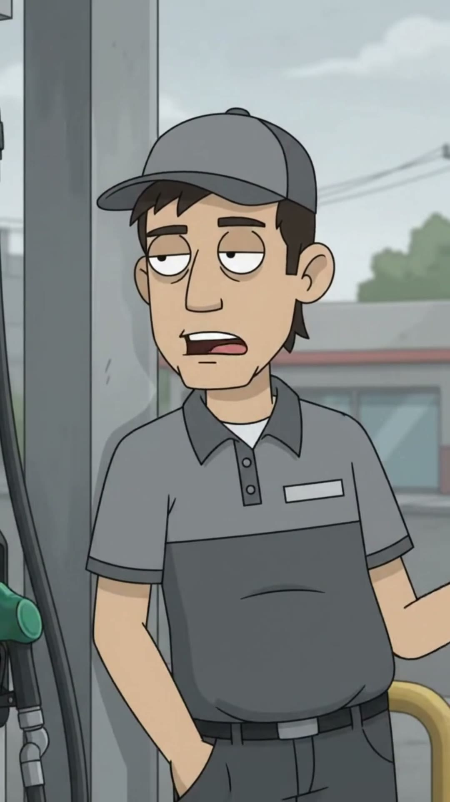

# Jhon Fredy

> **Arquetipo:** El trabajador (straight man)  ·  **Estado:** 🟢 Canon (ya salió en un episodio)



## Ficha rápida
| | |
|---|---|
| **Edad** | 29 |
| **Oficio** | Bombero (despachador) de la gasolinera Tervonx. |
| **Quiere** | Que se acabe el turno. |
| **Teme** | Nada; gana el mínimo. |
| **Frase típica** | "¿Full, patrón?" |
| **Temas que satiriza** | `capitalismo-de-conveniencia` |

## Descripción física
- **Complexión y estatura:** Medio (1,72 m), delgado fibroso, hombros un poco caídos de cansancio.
- **Rostro:** Cara ovalada y joven, nariz mediana, boca ligeramente torcida hacia un lado en gesto de indiferencia. Barba incipiente dispareja.
- **Ojos:** Ojos saltones de la marca con **párpados a media asta**, mirada de "ya he visto todo". Nunca se abren del todo.
- **Pelo:** Negro, corto, oculto casi todo bajo la gorra; patillas cortas.
- **Piel:** Morena clara (`#C99A74`), bronceada por el sol que nunca sale (misterio de Digitalia).
- **Señas particulares:** Mancha de grasa en la mejilla. Olor a gasolina (visualmente: una pequeña nube ondulada en algunos planos).

## Vestuario
- **Look principal:** **Gorra gris** (`#7A7D84`) con visera, **polo gris** de uniforme con cuello oscuro y **placa con su nombre**, pantalón gris oscuro, zapatos de trabajo negros.
- **Variantes:** Chaqueta impermeable gris en lluvia. En otros episodios aparece con **otros uniformes de trabajo mal pagado** (domiciliario, guarda de seguridad, cajero) con la misma cara.
- **Accesorios icónicos:** Pistola del surtidor, trapo en el bolsillo trasero, limpiavidrios.

## Lenguaje corporal y expresiones
- **Postura:** Apoyado con una mano en la cintura o recostado en el surtidor, peso en una pierna.
- **Gestos recurrentes:** Limpia el vidrio sin mirar. Mastica chicle lentamente. Mira a cámara (ruptura sutil) cuando el cliente enloquece.
- **Expresión por defecto:** Indiferencia absoluta.
- **Rango de expresiones:** Mínimo. Un levantamiento de ceja es su máxima emoción.

## Personalidad
Jhon Fredy es el **testigo imperturbable** de la ciudad: ve a la clase media perder la cabeza todos los días y no mueve un músculo. Gana el mínimo, no tiene acciones, no tiene máscara. No le afecta la subida del precio porque nunca ha podido pagarlo.
- **Contradicción central:** Es el único que no tiene de qué indignarse… y el único con razones reales.
- **Virtudes:** Calma zen, sentido común, honestidad seca.
- **Defectos:** Apatía total; no le interesa nada fuera del turno.
- **Qué lo alegra / qué lo saca de quicio:** Lo alegra la hora de salida. Nada lo saca de quicio.

## Cómo habla
- **Voz:** Masculina de 29 años, grave, arrastrada, de barrio, sin prisa.
- **Ritmo y tono:** Una sola frase seca por episodio, dicha lento.
- **Muletillas:** "Ajá, patrón." · "Normal." · "¿Full?"
- **Frases de ejemplo:** "¿Full, patrón?" · "Así está el mundo." · "La máscara no le baja el precio, patrón."

## Historia
Trabaja en la gasolinera Tervonx desde hace 8 años, en turnos de 12 horas. Vive en el Barrio La Esperanza. Es el "straight man" del universo: el que mira el absurdo con cara de nada.

## Relación con la tecnología
Celular con la pantalla rota y plan prepago. No tiene redes. Lo usa para ver fútbol en el turno de noche.

## Rol cómico
- **Función:** Contrapunto. Su calma hace más ridícula la histeria de los demás.
- **Situaciones ideales:** Cameos en distintos trabajos precarios; testigo de berrinches de clase media.
- **Evitar:** Hacerlo objeto de burla por su clase; él es quien se ríe (por dentro).

## Estilo visual del personaje
- **Paleta propia:** gorra/polo `#7A7D84` · cuello `#3E4047` · pantalón `#4A4C52` · piel `#C99A74` · amarillo de la gasolinera `#E0B43C` como fondo.
- **Luz que le queda:** Luz plana de mediodía nublado bajo el techo de la estación.
- **Encuadres:** Plano medio fijo, casi frontal, como testigo; plano general pequeño al fondo del berrinche.
- **Consistencia:** gorra gris, polo gris con placa, cara de indiferencia.

## Prompt de consistencia
```
bored gas station attendant in his late 20s, slim wiry build, oval young face with patchy stubble, half-closed unimpressed eyes, mouth twisted to one side, light brown skin, grey baseball cap, grey uniform polo shirt with dark collar and a name tag, dark grey work trousers, rag in his back pocket, leaning on a fuel pump with one hand on his hip
```

## Relaciones
_Fuente de verdad: [05-grafo/grafo.json](../../05-grafo/grafo.json). Si cambias algo aquí, cámbialo también allá._

- → `trabaja_en` [Tervonx](../../02-mundo/organizaciones.md#tervonx) — gasolinera
- ← [Andrés "El Bull" Rentería](../../03-personajes/el-inversionista/ficha.md) `choca_con` — EP004
- → `trabaja_en` [Gasolinera Tervonx](../../04-locaciones/gasolinera-tervonx/ficha.md)

## Episodios
- [EP004 · El capital es bueno hasta que…](../../06-episodios/EP004-el-capital-es-bueno-hasta-que/README.md)

## Notas / ideas pendientes
-
