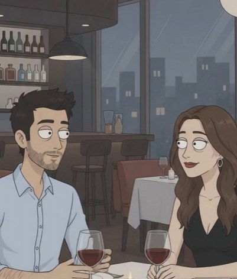

# Julián Moreno

> **Arquetipo:** El buen tipo (con Android)  ·  **Estado:** 🟢 Canon (ya salió en un episodio)



## Ficha rápida
| | |
|---|---|
| **Edad** | 31 |
| **Oficio** | Diseñador freelance. |
| **Quiere** | Una segunda cita. |
| **Teme** | Que le pregunten el modelo de su celular. |
| **Frase típica** | "¿Pido otra botella?" |
| **Temas que satiriza** | `apps-de-citas` |

## Descripción física
- **Complexión y estatura:** Medio-alto (1,78 m), delgado normal, hombros relajados.
- **Rostro:** Cara alargada amable, pómulos suaves, nariz recta un poco larga, **barba corta** oscura y algo desigual, sonrisa abierta y nerviosa.
- **Ojos:** Ojos saltones de la marca, mirada ingenua y entusiasta, cejas que se levantan cuando está contento. Ojeras leves de freelance.
- **Pelo:** **Negro, alborotado**, con volumen y mechones parados, como si se lo hubiera arreglado con los dedos.
- **Piel:** Clara bronceada (`#E2BB9A`).
- **Señas particulares:** Se ríe con la boca muy abierta. Una cicatriz pequeña en el antebrazo (de bici).

## Vestuario
- **Look principal:** **Camisa celeste** (`#BCD0E4`) de botones, **mangas arremangadas**, un botón abierto en el cuello, pantalón oscuro, zapatos café.
- **Variantes:** Camiseta gris con chaqueta de jean en el día; hoodie verde oliva trabajando en casa.
- **Accesorios icónicos:** **Su celular Android** (verde en la pantalla de inicio, funda sencilla negra, pantalla un poco rajada), copa de vino, bicicleta.

## Lenguaje corporal y expresiones
- **Postura:** Inclinado hacia adelante, interesado, gesticulando con una mano.
- **Gestos recurrentes:** Sirve más vino, ríe de sus propios chistes, deja el celular boca arriba sobre la mesa (error fatal).
- **Expresión por defecto:** Sonrisa entusiasta y un poco nerviosa.
- **Rango de expresiones:** Felicidad genuina, confusión total cuando lo rechazan sin saber por qué, vergüenza.

## Personalidad
Julián es el tipo "bueno": puntual, atento, paga la cuenta, cuenta anécdotas simpáticas. Y pierde. Siempre por detalles que ni sabe que existen: el celular, el carro, el signo zodiacal. No entiende las reglas del mercado de las citas, y eso lo hace entrañable.
- **Contradicción central:** Cumple todo lo que "piden" las personas y aun así no pasa el filtro.
- **Virtudes:** Amable, honesto, divertido, creativo.
- **Defectos:** Ingenuo, habla demasiado cuando está nervioso, no lee señales.
- **Qué lo alegra / qué lo saca de quicio:** Lo alegra una segunda cita. Lo desconcierta "no eres tú, es tu celular".

## Cómo habla
- **Voz:** Masculina de 31 años, amable, entusiasta, un poco atropellada.
- **Ritmo y tono:** Conversador, divaga, cuenta anécdotas largas.
- **Muletillas:** "¡Qué chévere!" · "No, pero escucha esto…" · "Jajaja, ¿sí o qué?"
- **Frases de ejemplo:** "¿Pido otra botella?" · "Este celular me dura como dos años más, fácil." · "Cuando se dañe, lo arreglo; es que yo soy muy práctico."

## Historia
Diseñador gráfico freelance, vive solo con una planta. Amigo de infancia de Brayan (el gym bro), quien le da pésimos consejos de citas. En EP002, Valentina lo descarta al ver su Android.

## Relación con la tecnología
Práctica: usa lo que funciona, no lo que está de moda. En Digitalia, eso es sospechoso.

## Rol cómico
- **Función:** El "buen tipo" que pierde por absurdos; perfecto para episodios de citas y consumo.
- **Situaciones ideales:** Citas fallidas; recibir consejos de Brayan; episodio espejo "Red Flags Masculinas".
- **Evitar:** Volverlo "nice guy" resentido; es genuinamente buena gente.

## Estilo visual del personaje
- **Paleta propia:** camisa `#BCD0E4` · pantalón `#2E3140` · pelo `#141212` · piel `#E2BB9A` · pantalla Android verde `#7BC67E`.
- **Luz que le queda:** Luz cálida de velas en el restaurante.
- **Encuadres:** Plano medio frente a Valentina en la mesa; detalle de su celular sobre el mantel.
- **Consistencia:** pelo negro alborotado, barba corta, camisa celeste arremangada.

## Prompt de consistencia
```
friendly man in his early 30s, average slim build, long kind face, short uneven dark beard, messy voluminous black hair, enthusiastic slightly nervous open smile, light blue button-up shirt with rolled-up sleeves and open collar, dark trousers, an Android phone with a cracked screen lying face up on the table, holding a glass of red wine
```

## Relaciones
_Fuente de verdad: [05-grafo/grafo.json](../../05-grafo/grafo.json). Si cambias algo aquí, cámbialo también allá._

- ← [Valentina Ríos](../../03-personajes/la-mujer-empoderada/ficha.md) `cita` — lo descarta por tener Android
- → `amistad` [Brayan "Proteína" Castaño](../../03-personajes/el-gym-bro/ficha.md) — su amigo le dice que el problema es la mentalidad
- → `frecuenta` [Restaurante La Terraza](../../04-locaciones/restaurante-la-terraza/ficha.md)

## Episodios
- [EP002 · Red Flags Femeninas](../../06-episodios/EP002-red-flags-femeninas/README.md)

## Notas / ideas pendientes
-
