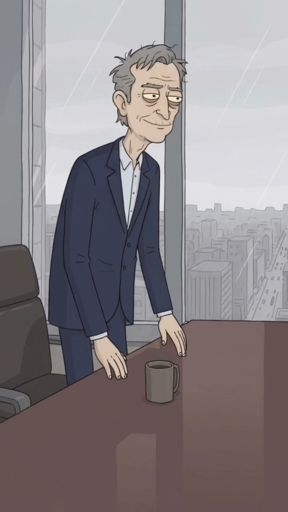

# Larry Finque

> **Arquetipo:** El capitalista  ·  **Estado:** 🟢 Canon (ya salió en un episodio)



## Ficha
| | |
|---|---|
| **Edad** | 70 |
| **Oficio** | CEO de Blakrok. Dueño de (casi) todo. |
| **Quiere** | Comprar la próxima protesta antes de que empiece. |
| **Teme** | Nada. Tal vez un trimestre plano. |
| **Frase típica** | "Ahora el pelo azul es resistencia." |
| **Temas que satiriza** | `corporaciones-absorben-protesta`, `vigilancia-datos` |

## Personalidad
Nunca se altera. Compra lo que sea que lo ataque: si protestan con pelo azul, compra la empresa de tinturas. Todas las organizaciones de la ciudad terminan, de alguna forma, siendo de Blakrok.

## Diseño visual
Viejo delgado, pelo canoso despeinado, ojeras moradas, sonrisa torcida de medio lado, traje azul marino con camisa blanca sin corbata, siempre con una taza de café. Fondo: ventanal con lluvia y la ciudad a sus pies.

**Prompt de consistencia** (pegar después del [prompt base de estilo](../../01-estilo-visual/prompts-base.md)):
```
thin old man around 70, messy grey hair, purple under-eye bags, sly half smile, navy suit with white open-collar shirt, holding a coffee mug, rainy floor-to-ceiling window with city below
```

## Relaciones
_Fuente de verdad: [05-grafo/grafo.json](../../05-grafo/grafo.json). Si cambias algo aquí, cámbialo también allá._

- → `dirige` [Blakrok](../../02-mundo/organizaciones.md#blakrok)
- → `compra` [Los Manifestantes de Pelo Azul](../../03-personajes/los-manifestantes/ficha.md) — la empresa de tinturas: el pelo azul es resistencia
- ← [Don Álvaro Mano Firme](../../03-personajes/el-de-derecha/ficha.md) `admira` — Larry no sabe que existe
- ← [Elón Mosca](../../03-personajes/el-ceo-tech/ficha.md) `financiado_por`
- → `frecuenta` [Torre Blakrok](../../04-locaciones/torre-blakrok/ficha.md)

## Episodios
- [EP003 · ¡Abajo las corporaciones!](../../06-episodios/EP003-abajo-las-corporaciones/README.md)

## Notas / ideas pendientes
-
