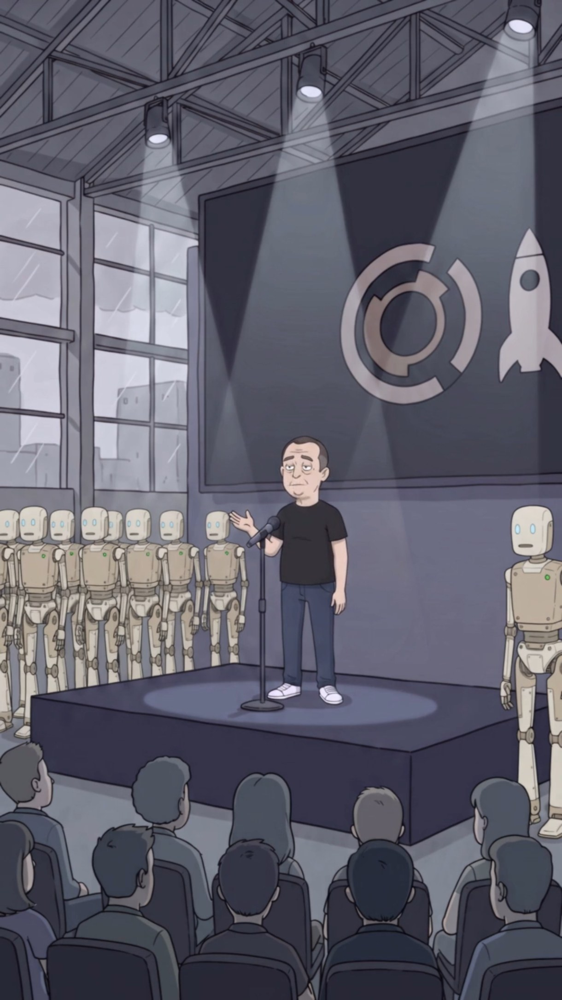

# Elón Mosca

> **Arquetipo:** El CEO  ·  **Estado:** 🟡 Diseñado (tiene imagen, sin episodio)




## Ficha
| | |
|---|---|
| **Edad** | 50 |
| **Oficio** | CEO de Xpacio (robots humanoides y cohetes). |
| **Quiere** | Irse a Marte (lejos de la ciudad que automatizó). |
| **Teme** | Que los robots pidan sindicato. |
| **Frase típica** | "Este robot no toma vacaciones. Ni ustedes, a partir de mañana." |
| **Temas que satiriza** | `ia-automatizacion`, `cultura-corporativa` |

## Personalidad
Anuncia el futuro con la energía de un lunes. Presenta robots que reemplazan empleados como si fuera un favor. Se lleva el crédito del trabajo de Marlon.

## Diseño visual
Calvicie incipiente, cara cansada con ojeras, camiseta negra, jeans, tenis blancos. Siempre bajo un spotlight en un escenario industrial, rodeado de robots en fila.

**Prompt de consistencia** (pegar después del [prompt base de estilo](../../01-estilo-visual/prompts-base.md)):
```
tired tech CEO in his 50s, receding short hair, droopy eyes and bags, plain black t-shirt, blue jeans, white sneakers, standing on a dark stage under spotlights with a microphone stand
```

## Relaciones
_Fuente de verdad: [05-grafo/grafo.json](../../05-grafo/grafo.json). Si cambias algo aquí, cámbialo también allá._

- → `dirige` [Xpacio](../../02-mundo/organizaciones.md#xpacio)
- → `creo` [Unidad‑7 ("Siete")](../../03-personajes/el-robot/ficha.md) — se lleva el crédito
- → `roba_credito` [Marlon Mosquera](../../03-personajes/el-negro/ficha.md)
- → `financiado_por` [Larry Finque](../../03-personajes/el-capitalista/ficha.md)
- → `frecuenta` [Hangar de lanzamientos Xpacio](../../04-locaciones/hangar-xpacio/ficha.md)

## Episodios
- Ninguno todavía.

## Notas / ideas pendientes
-
