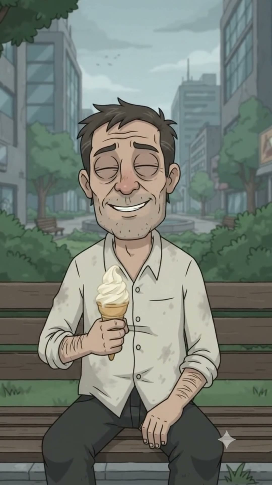

# Rodrigo Nadie

> **Arquetipo:** El último humano offline  ·  **Estado:** 🟢 Canon (ya salió en un episodio)




## Ficha rápida
| | |
|---|---|
| **Edad** | 40 |
| **Oficio** | Ninguno registrado. Legalmente no existe. |
| **Quiere** | Comerse un helado en paz. |
| **Teme** | Los agentes de verificación. |
| **Frase típica** | "No tengo redes… ¿eso es ilegal?" |
| **Temas que satiriza** | `vigilancia-datos`, `adiccion-digital` |

## Descripción física
- **Complexión y estatura:** Medio (1,75 m), delgado pero fibroso, de alguien que camina a todas partes. Espalda recta: es el único que no tiene "cuello de texto".
- **Rostro:** Cara ovalada, ligeramente demacrada, pómulos marcados, **barba de varios días** gris-castaña, nariz mediana, arrugas de expresión en la frente.
- **Ojos:** Ojos saltones de la marca **muy abiertos** (terror) con pupilas diminutas; ojeras profundas. Al final, **ojos cerrados de felicidad** con el helado.
- **Pelo:** Castaño, desordenado, con mechones que caen sobre la frente, como cortado por él mismo.
- **Piel:** Clara (`#E4C2A2`) con color más sano que el resto (le da el poco aire libre que hay). **Sudor** en la frente cuando lo rodean.
- **Señas particulares:** Manos que se palpan los bolsillos buscando un celular que no existe. Es el único personaje con **la cara sin reflejo de pantalla**.

## Vestuario
- **Look principal:** **Camisa blanca manchada** (`#E9E4D8`) arremangada hasta el codo, con manchas de tierra, **pantalón café oscuro** (`#4E4036`), zapatos de cuero viejos.
- **Variantes:** Ninguna: tiene una sola camisa.
- **Accesorios icónicos:** **Helado de vainilla en cono** (su símbolo de libertad). Bolsillos vacíos. Un reloj de pulsera análogo.

## Lenguaje corporal y expresiones
- **Postura:** Rígido, en guardia, como un animal rodeado. Cuando está solo: relajado en la banca, piernas estiradas.
- **Gestos recurrentes:** Se palpa los bolsillos, retrocede cuando lo graban, levanta las manos como diciendo "no tengo nada".
- **Expresión por defecto:** Pánico sudoroso.
- **Rango de expresiones:** Terror (ojos enormes, boca temblorosa), desconcierto, y una **paz absoluta** con ojos cerrados y sonrisa leve (el único momento feliz del universo).

## Personalidad
Rodrigo no tiene celular, ni redes, ni datos. No por rebelde: simplemente se le perdió el teléfono hace años y descubrió que vivía mejor. Para el sistema de Digitalia es un error: "Ciudadano no verificado". Para los demás, un bicho raro. Es el personaje más cuerdo de la ciudad y el único criminal.
- **Contradicción central:** El único humano libre es un fugitivo.
- **Virtudes:** Presente, observador, auténtico, disfruta lo simple.
- **Defectos:** Paranoico (con razón), torpe socialmente, no entiende los chistes de internet.
- **Qué lo alegra / qué lo saca de quicio:** Lo alegra un helado en una banca. Lo aterra un celular apuntándole.

## Cómo habla
- **Voz:** Masculina de 40 años, cálida pero nerviosa, un poco ronca de no hablar con nadie.
- **Ritmo y tono:** Titubeante, preguntas genuinas.
- **Muletillas:** "¿Eh?" · "Perdón…" · "¿Eso es ilegal?"
- **Frases de ejemplo:** "No tengo redes… ¿eso es ilegal?" · "¿Parte del sistema? Yo solo quería un helado." · "¿Me pueden decir la hora? …¿Sin buscarla en el celular?"

## Historia
Perdió el celular hace cinco años. Cuando fue a reponerlo, ya no tenía cómo verificar su identidad (todo requería un código enviado… al celular). Desde entonces vive sin datos. En EP001 los agentes de Blakrok lo persiguen como "ciudadano no verificado". Escapa al Parque Central, el único lugar sin señal. Aliado natural: Kevin, que usa celular de tapa, y el restaurante Chen's, que no tiene Wi‑Fi.

## Relación con la tecnología
Ninguna. Ni siquiera sabe qué es un "reel". Esto lo vuelve invisible y sospechoso a la vez.

## Rol cómico
- **Función:** El espejo: a través de sus ojos, el comportamiento "normal" de la ciudad se ve absurdo.
- **Situaciones ideales:** Trámites imposibles sin celular, escapar de los agentes, pedir una dirección y que le manden un pin.
- **Evitar:** Hacerlo un gurú anti-tecnología sermoneador; es un tipo confundido, no un predicador.

## Estilo visual del personaje
- **Paleta propia:** camisa `#E9E4D8` · pantalón `#4E4036` · piel `#E4C2A2` · helado `#F6EEDC` · el verde del parque `#6E8A5E` como su color de refugio.
- **Luz que le queda:** Tormenta gris-verde en la ciudad; **luz un poco más cálida** en el parque. Es el único sin luz azul de pantalla en la cara.
- **Encuadres:** Plano cenital de él pequeño en el centro de un círculo de zombis; primer plano de su sudor; plano medio en la banca con el helado.
- **Consistencia:** camisa blanca manchada arremangada, pantalón café, barba de días, cero celular.

## Prompt de consistencia
```
scruffy man around 40, lean wiry build with upright posture, slightly gaunt oval face, several days of grey-brown stubble, messy self-cut brown hair, wide terrified bulging eyes with tiny pupils and deep bags, sweat on his forehead, stained white shirt with sleeves rolled to the elbows, dark brown trousers, worn leather shoes, empty hands patting his empty pockets, no phone
```

## Relaciones
_Fuente de verdad: [05-grafo/grafo.json](../../05-grafo/grafo.json). Si cambias algo aquí, cámbialo también allá._

- ← [Kevin Chen Restrepo](../../03-personajes/el-asiatico/ficha.md) `alianza` — los dos usan celular de tapa / ninguno
- ← [Agentes de Verificación](../../03-personajes/los-agentes/ficha.md) `persigue` — ciudadano no verificado
- ← [Los Zombis Digitales](../../03-personajes/los-zombis-digitales/ficha.md) `acosa` — lo graban
- → `frecuenta` [Plaza Central / Avenida Principal](../../04-locaciones/plaza-central/ficha.md)
- → `frecuenta` [Parque Central (la banca)](../../04-locaciones/parque-central/ficha.md) — su banca
- → `frecuenta` [Chen's](../../04-locaciones/restaurante-chen/ficha.md) — refugio sin wifi

## Episodios
- [EP001 · Humano OFFLINE](../../06-episodios/EP001-humano-offline/README.md)

## Notas / ideas pendientes
-
