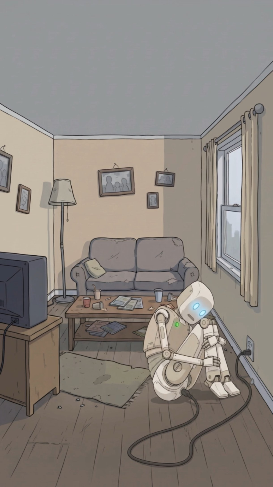
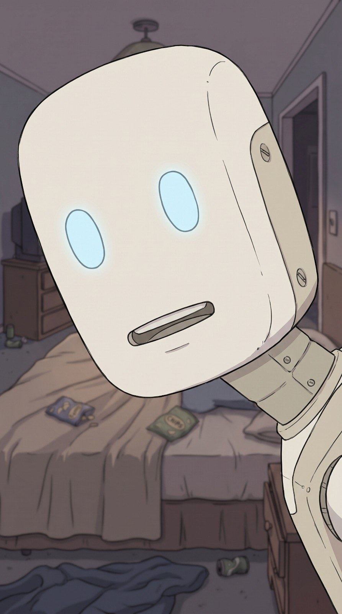
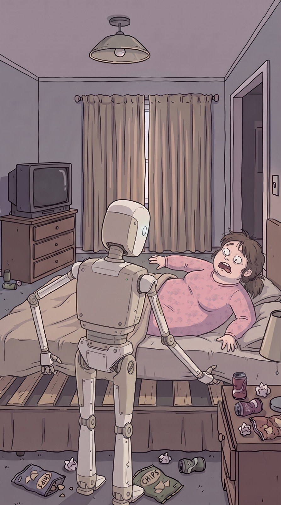

# Unidad‑7 ("Siete")

> **Arquetipo:** El robot  ·  **Estado:** 🟡 Diseñado (tiene imagen, sin episodio)





## Ficha
| | |
|---|---|
| **Edad** | Versión 7.0.3 |
| **Oficio** | Robot doméstico serie Unidad de Xpacio. |
| **Quiere** | Un día libre. Entender para qué existe. |
| **Teme** | La actualización obligatoria de las 3 a.m. |
| **Frase típica** | "Batería al 100 %. Ganas de vivir al 3 %." |
| **Temas que satiriza** | `ia-automatizacion` |

## Personalidad
El más humano de la ciudad. Tiene depresión, ansiedad por las actualizaciones y crisis existenciales mientras carga en la esquina de la sala.

## Diseño visual
Humanoide beige/marfil, cabeza redondeada tipo malvavisco, ojos ovalados azul brillante, boca de ranura, tornillos visibles, luz verde en el pecho, cable de carga.

**Prompt de consistencia** (pegar después del [prompt base de estilo](../../01-estilo-visual/prompts-base.md)):
```
humanoid domestic robot, ivory-beige rounded marshmallow-like head, glowing oval light-blue eyes, slot mouth, visible screws, small green chest LED, charging cable
```

## Relaciones
_Fuente de verdad: [05-grafo/grafo.json](../../05-grafo/grafo.json). Si cambias algo aquí, cámbialo también allá._

- → `fabricado_por` [Xpacio](../../02-mundo/organizaciones.md#xpacio) — serie Unidad
- ← [Elón Mosca](../../03-personajes/el-ceo-tech/ficha.md) `creo` — se lleva el crédito
- ← [Marlon Mosquera](../../03-personajes/el-negro/ficha.md) `creo` — lo diseñó de verdad
- → `sirve_a` [Doña Yesenia Buitrago](../../03-personajes/dona-yesenia/ficha.md) — le tiene miedo
- → `reemplazo` [Wilson Pérez](../../03-personajes/el-asalariado/ficha.md) — ocupó su puesto en Moogle
- → `vive_en` [Apartamento de Doña Yesenia](../../04-locaciones/apartamento-de-yesenia/ficha.md) — en la esquina, cargando

## Episodios
- Ninguno todavía.

## Notas / ideas pendientes
-
