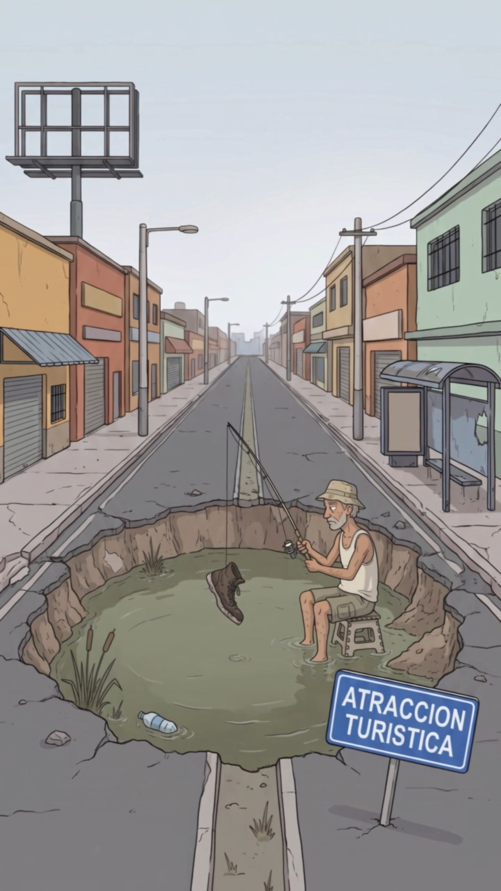

# Locaciones de Digitalia

Cada lugar tiene `ficha.md` (descripción, luz, prompt) + `imagenes/`. Mantén la misma locación visualmente idéntica entre episodios: reusa su prompt y sus imágenes como referencia.

| | Lugar | Tipo | Estado |
|---|---|---|---|
|  | [Torre Blakrok](torre-blakrok/ficha.md) | Corporativo | 🟢 Canon |
|  | [Oficinas de Moogle](oficinas-moogle/ficha.md) | Corporativo | 🟢 Canon |
| — | [Hangar de lanzamientos Xpacio](hangar-xpacio/ficha.md) | Corporativo | 🟡 Diseñado |
|  | [Calle del Bache (Barrio La Esperanza)](calle-del-bache/ficha.md) | Barrio popular | 🟡 Diseñado |
| — | [Plaza Central / Avenida Principal](plaza-central/ficha.md) | Espacio público | 🟢 Canon |
| — | [Parque Central (la banca)](parque-central/ficha.md) | Espacio público | 🟢 Canon |
| — | [Gasolinera Tervonx](gasolinera-tervonx/ficha.md) | Comercio | 🟢 Canon |
|  | [Restaurante La Terraza](restaurante-la-terraza/ficha.md) | Comercio | 🟢 Canon |
|  | [Apartamento de Valentina](apartamento-de-valentina/ficha.md) | Vivienda | 🟢 Canon |
| — | [Apartamento de Doña Yesenia](apartamento-de-yesenia/ficha.md) | Vivienda | 🟡 Diseñado |
| — | [Edificio de la Alcaldía](alcaldia/ficha.md) | Institucional | ⚪ Propuesto |
| — | [Gimnasio Alpha Mindset](gimnasio-alpha-mindset/ficha.md) | Comercio | ⚪ Propuesto |
| — | [Café Contexto](cafe-contexto/ficha.md) | Comercio | ⚪ Propuesto |
| — | [Taller de Bicis de Majo](taller-de-majo/ficha.md) | Comercio | ⚪ Propuesto |
| — | [La Esquina del Semáforo](esquina-del-semaforo/ficha.md) | Espacio público | ⚪ Propuesto |
| — | [Chen's](restaurante-chen/ficha.md) | Comercio | ⚪ Propuesto |
| — | [Grupo de WhatsApp "Familia Unida 🙏"](grupo-familia-unida/ficha.md) | Lugar digital | ⚪ Propuesto |

## Cómo agregar una locación
1. Copia [`07-plantillas/ficha-locacion.md`](../07-plantillas/ficha-locacion.md) a `04-locaciones/<slug>/ficha.md`.
2. Guarda imágenes en `imagenes/` (`<slug>__exterior.jpg`, `<slug>__interior-noche.jpg`).
3. Agrégala al grafo (`05-grafo/grafo.json`) y conéctala con quién la frecuenta.
