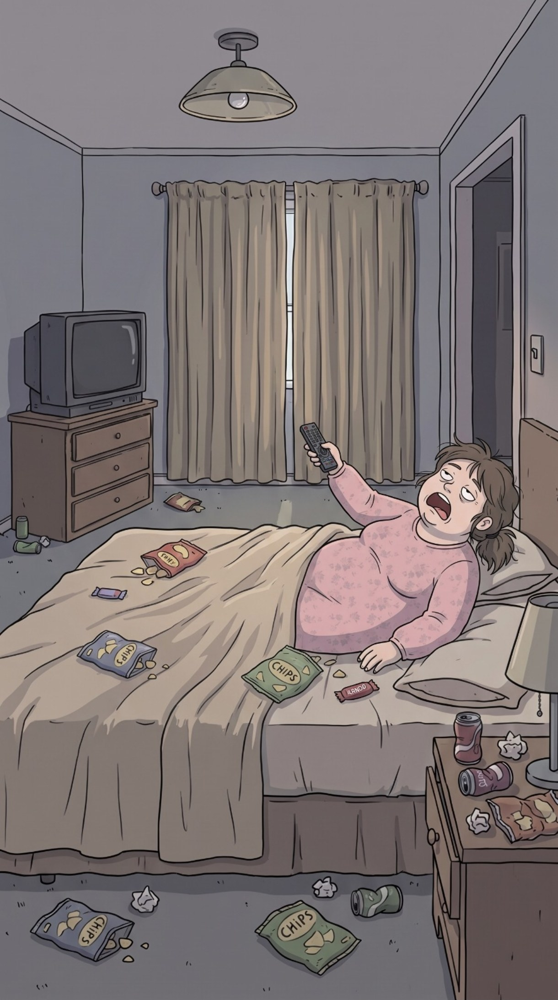

# Apartamento de Doña Yesenia

> **Tipo:** Vivienda  ·  **Estado:** 🟡 Diseñado (tiene imagen, sin episodio)




## Descripción general
Un apartamento pequeño y viejo en el Barrio La Esperanza donde Doña Yesenia vive acostada y su robot Unidad‑7 vive deprimido. Encierro, desorden y el brillo de la TV. El lugar donde la tecnología del futuro sirve papas en un cuarto del pasado.

## Arquitectura y distribución
- **Cuarto:** Pequeño, paredes **gris lila** (`#8E8A98`), techo bajo con **lámpara de techo tipo campana** con bombillo desnudo, **cortinas beige** (`#BCAB90`) largas **siempre cerradas** con una rendija de luz. Cama doble con **cabecero de madera café**, sábanas beige arrugadas. **Cómoda de madera** de tres cajones con una **TV de tubo** (CRT) gris encima. Mesa de noche con lámpara de pantalla beige. Puerta abierta a un pasillo oscuro.
- **Sala:** Paredes **crema-amarillentas** (`#D8C9A8`) con molduras blancas, **sofá gris-lila roto** con cojines hundidos, mesa de centro de madera con vasos, revistas y basura, **lámpara de pie** con pantalla torcida, **cuadros familiares** con fotos grises, ventana de guillotina con cortinas, TV vieja sobre mueble, piso de madera gastado con alfombra manchada. **Enchufe en la esquina** donde carga el robot.

## Utilería y detalles clave
**Bolsas de papas (CHIPS)** de colores rojo, azul y verde por todas partes, **latas de gaseosa** aplastadas, pañuelos arrugados, control remoto, envolturas de chocolatinas, cargador de 3 metros, cable del robot, caja de Xpacio abierta en el rincón.

## Estilo visual
- **Paleta:** cuarto `#8E8A98` · cortinas `#BCAB90` · madera `#6B4A36` · sábanas `#C9B8A2` · sala `#D8C9A8` · sofá `#8A8494` · papas `#C0463A`, `#4A5A8C`, `#6C8A4A` · bombillo `#E8D39A`.
- **Texturas:** Tela gastada, madera rayada, pintura con humedad, migas.
- **Iluminación:** **Penumbra lila-gris**; un bombillo amarillo débil y la rendija de luz fría entre las cortinas. En la sala, luz gris de ventana y los **ojos azules del robot** como fuente de luz.
- **Clima:** Día gris afuera (casi no se ve).
- **Atmósfera y sonido:** TV de fondo, crujido de papas, zumbido de carga del robot, gritos de "¡Siete!".

## Encuadres recomendados
- Plano general del cuarto desde los pies de la cama (TV a la izquierda, cama a la derecha).
- Plano desde detrás del robot hacia Yesenia.
- Plano general de la sala en perspectiva con el robot pequeño en la esquina.

## Uso narrativo
Sátira de la comodidad automatizada. Dupla Yesenia–Unidad‑7. Episodios de robots deprimidos, actualizaciones y pereza.

## Prompt de locación
```
cramped messy bedroom with lilac-grey walls, bell-shaped ceiling lamp with a bare bulb, long closed beige curtains with a thin sliver of light, double bed with wooden headboard and wrinkled beige sheets covered in colorful chip bags and crumbs, old grey CRT TV on a three-drawer wooden dresser, bedside table with a beige lampshade, crushed soda cans and crumpled tissues on the floor, dim purple-grey light
```
**Sala:**
```
shabby small living room with cream-yellow walls and white moldings, torn grey-lilac sofa, wooden coffee table cluttered with cups and magazines, crooked floor lamp, grey family photos in frames, sash window with curtains, old TV on a wooden stand, worn wooden floor with a stained rug, a wall outlet in the corner
```

## Quién aparece aquí
- ← [Doña Yesenia Buitrago](../../03-personajes/dona-yesenia/ficha.md) `vive_en`
- ← [Unidad‑7 ("Siete")](../../03-personajes/el-robot/ficha.md) `vive_en` — en la esquina, cargando

## Episodios
- Ninguno todavía.
