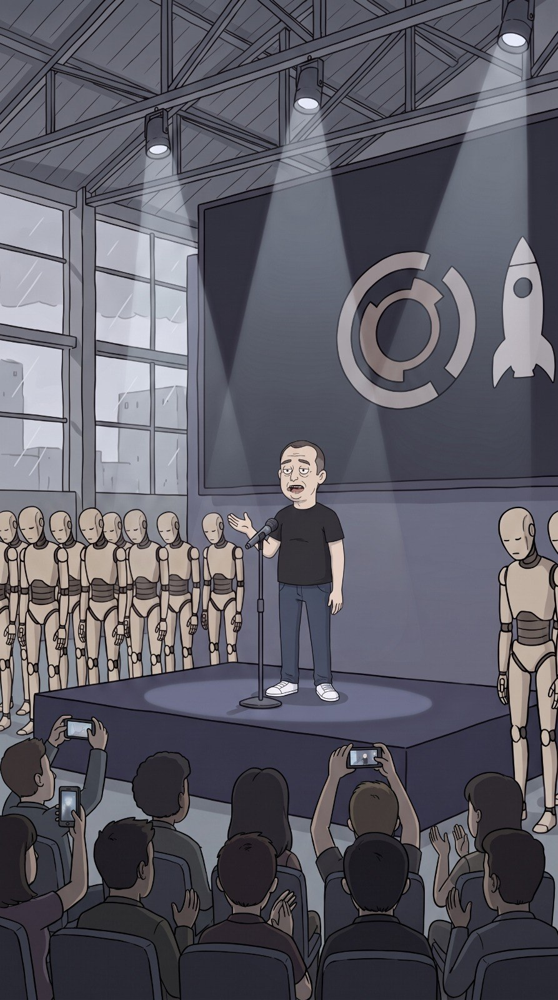

# Hangar de lanzamientos Xpacio

> **Tipo:** Corporativo  ·  **Estado:** 🟡 Diseñado (tiene imagen, sin episodio)



## Descripción general
Una antigua bodega industrial convertida en el escenario de lanzamientos de Xpacio. Aquí Elón presenta cada nuevo robot ante un público que graba todo con el celular. Mitad fábrica, mitad iglesia tecnológica.

## Arquitectura y distribución
- **Estructura:** Nave industrial de techo alto con **cerchas metálicas** (vigas en X) grises, techo de lámina inclinado, **ventanales de fábrica** cuadriculados a la izquierda con lluvia y siluetas de edificios.
- **Escenario:** Tarima negra rectangular elevada (~1 m) al centro. Detrás, **pantalla gigante oscura** con el **logo de Xpacio**: un **anillo segmentado** (tipo engranaje abierto) beige y un **cohete** blanco.
- **Laterales:** **Filas de robots humanoides beige** (serie Unidad) de pie, inmóviles, cabeza baja, a ambos lados del escenario.
- **Público:** Sillas negras en filas, gente de espaldas en primer plano, muchos con celulares en alto.
- **Detrás del escenario:** Taller de Marlon con mesas de trabajo, cables, cabezas de robot abiertas.

## Utilería y detalles clave
Micrófono de pedestal, tres **reflectores** colgados de las cerchas, cables en el piso, cinta amarilla de seguridad, cajas de envío con el logo. Un robot siempre "fallando" al fondo.

## Estilo visual
- **Paleta:** estructura `#5A5E68` · penumbra `#3A3D4A` · escenario `#23242B` · pantalla `#2E3140` · logo `#D9CBB5` · robots `#D9CBB5` con juntas `#A89C88` · haces de luz `#EDEBE6`.
- **Texturas:** Metal mate, concreto pulido, polvo en suspensión, pantalla negra brillante.
- **Iluminación:** **Tres spotlights en cono marcado con polvo en el aire** desde el techo, uno sobre el presentador formando un círculo de luz en la tarima. El resto en penumbra azul-gris. Ventanales con luz gris de lluvia.
- **Clima:** Lluvia visible en los ventanales.
- **Atmósfera y sonido:** Eco de bodega, zumbido eléctrico, aplausos tibios, obturadores de celular, servomotores de los robots.

## Encuadres recomendados
- Plano general vertical desde detrás del público: cabezas y celulares abajo, presentador pequeño arriba en su círculo de luz, robots a los lados.
- Plano medio del CEO bajo el spotlight con el logo detrás.
- Plano detalle de las caras inexpresivas de los robots en fila.

## Uso narrativo
Donde se anuncia el futuro que reemplaza a todos. Keynotes, fallos en vivo, Marlon arreglando detrás. Nacimiento de Unidad‑7.

## Prompt de locación
```
huge industrial warehouse used as a keynote venue, steel truss roof with X-beams, tall grid factory windows with rain and distant buildings, a black raised stage with a microphone stand, giant dark screen with a beige segmented ring logo and a white rocket icon, rows of identical beige humanoid robots standing on both sides, audience seen from behind holding up smartphones, three spotlights with visible dusty light cones, bluish-grey gloom
```

## Quién aparece aquí
- ← [Xpacio](../../02-mundo/organizaciones.md#xpacio) `sede`
- ← [Elón Mosca](../../03-personajes/el-ceo-tech/ficha.md) `frecuenta`
- ← [Marlon Mosquera](../../03-personajes/el-negro/ficha.md) `trabaja_en`

## Episodios
- Ninguno todavía.
