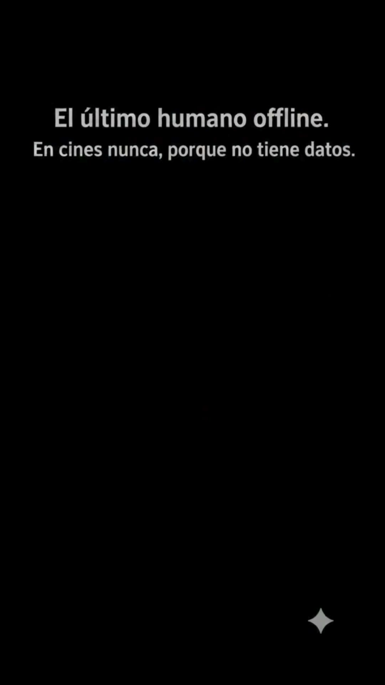

# Parque Central (la banca)

> **Tipo:** Espacio público  ·  **Estado:** 🟢 Canon (ya salió en un episodio)




## Descripción general
El único lugar verde de Digitalia y, sobre todo, **el único lugar sin señal**. Nadie sabe si es por los árboles o por un error de la red. Aquí Rodrigo se come su helado en paz. Es el respiro visual del universo.

## Arquitectura y distribución
- **Sendero:** Camino de baldosa o gravilla gris que atraviesa el parque, con bordes de concreto.
- **Vegetación:** **Árboles frondosos** de copa redonda (verde apagado), arbustos recortados bajos, césped algo descuidado.
- **Mobiliario:** **Una banca de madera** con patas de hierro negro (la banca de Rodrigo), un farol antiguo negro, una caneca verde.
- **Alrededores:** Edificios grises del centro asomando por encima de los árboles, carteles lejanos borrosos.

## Utilería y detalles clave
Helado de vainilla en cono, hojas secas en la banca, palomas, un letrero oxidado "Zona sin cobertura" (gag), un celular abandonado en la caneca.

## Estilo visual
- **Paleta:** árboles `#5E7A55` · arbustos `#6E8A5E` · césped `#7F9160` · madera banca `#8A6A4E` · hierro `#2E2E33` · sendero `#9C9C97` · edificios `#7C8286`.
- **Texturas:** Follaje en masas redondas con poco detalle, madera veteada, baldosa con musgo.
- **Iluminación:** Nublado pero **un poco más cálido y claro** que el resto de la ciudad: es el único lugar con un tinte ligeramente dorado. **De noche:** un farol solitario ilumina la banca en un círculo cálido en medio de la oscuridad verde-azul.
- **Clima:** Nubes, pero se abre un pequeño claro.
- **Atmósfera y sonido:** Pájaros, hojas, silencio (ninguna notificación). Es el único lugar donde la música de fondo es acústica.

## Encuadres recomendados
- Plano medio frontal de un personaje en la banca con árboles detrás.
- Plano general alejándose: la banca pequeña en el centro del parque (cierre de episodio).
- Plano nocturno con farol y personaje solo.

## Uso narrativo
El refugio, el final feliz y el lugar para los momentos "humanos". Cierre de EP001. Ideal para remates melancólicos o pausas.

## Prompt de locación
```
small city park with round leafy muted-green trees and trimmed bushes, a grey paved path, a single wooden bench with black iron legs, an old black lamp post, grey buildings peeking above the treetops, overcast sky slightly warmer and brighter than the rest of the city
```
**Variante noche:**
```
the same park at night, dark blue-green gloom, a single lamp post casting a warm circle of light on the lonely wooden bench
```

## Quién aparece aquí
- ← [Rodrigo Nadie](../../03-personajes/el-humano-offline/ficha.md) `frecuenta` — su banca

## Episodios
- [EP001 · Humano OFFLINE](../../06-episodios/EP001-humano-offline/README.md)
