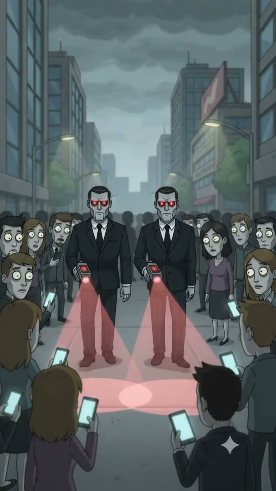

# Plaza Central / Avenida Principal

> **Tipo:** Espacio público  ·  **Estado:** 🟢 Canon (ya salió en un episodio)




## Descripción general
La gran avenida y plaza del centro de Digitalia, entre edificios de oficinas grises, con la Torre Blakrok siempre al fondo. Es el lugar de las multitudes: la marea de zombis digitales caminando con el celular, y las marchas contra las corporaciones.

## Arquitectura y distribución
- **Avenida:** Ancha, de cuatro carriles, con andenes amplios de baldosa gris y separador central.
- **Edificios:** Torres de oficinas de 10–20 pisos de **vidrio gris-verdoso y concreto**, fachadas cuadriculadas, algunos avisos luminosos rojos pequeños.
- **Plaza:** Explanada abierta de baldosas grises frente a la Torre Blakrok, con postes de luz modernos, bancas de concreto y un par de árboles flacos.
- **Pantalla urbana:** Una pantalla LED gigante (de Blakrok) visible desde la plaza, que muestra alertas en rojo.

## Utilería y detalles clave
Semáforos, cámaras de vigilancia en cada poste, papeles volando, pancartas abandonadas después de marchas, banderas arcoíris en el piso, celulares en todas las manos.

## Estilo visual
- **Paleta:** edificios `#6E7773` · vidrio `#7F8C88` · baldosa `#A5A7A6` · cielo de tormenta `#7D8683` · pantallas `#CEEEF9` · alerta `#D23C2E`.
- **Texturas:** Vidrio con reflejos, baldosa mojada, cielo con nubes pesadas.
- **Iluminación:** **Tormenta a punto de caer**, luz verde-gris dramática; las pantallas de los celulares iluminan las caras en azul. En marchas (EP003): día nublado plano y más claro.
- **Clima:** Nubes negras, viento, a veces lluvia.
- **Atmósfera y sonido:** Murmullo de multitud, notificaciones, obturadores, consignas por megáfono.

## Encuadres recomendados
- **Cenital** con un personaje en el centro de un círculo de gente.
- Plano general de la marcha hacia cámara con la torre Blakrok detrás.
- Plano medio del protagonista con la multitud desenfocada grabándolo.

## Uso narrativo
Donde la masa juzga y graba. EP001 (Rodrigo rodeado, "Ciudadano no verificado") y EP003 (la marcha). Lugar para cualquier episodio de viralidad, presión social o protesta.

## Prompt de locación
```
wide downtown avenue and open plaza with grey-green glass office towers and grey concrete, big grey paving tiles, modern street lamps with surveillance cameras, a giant LED screen on a building, a black skyscraper in the distance, dense crowd of people staring at glowing phones, dark green-grey stormy sky
```

## Quién aparece aquí
- ← [Rodrigo Nadie](../../03-personajes/el-humano-offline/ficha.md) `frecuenta`
- ← [Los Zombis Digitales](../../03-personajes/los-zombis-digitales/ficha.md) `frecuenta`
- ← [Los Manifestantes de Pelo Azul](../../03-personajes/los-manifestantes/ficha.md) `frecuenta` — marchas
- ← [Nicolás "Nico" Barricada](../../03-personajes/el-de-izquierda/ficha.md) `frecuenta` — marchas
- ← [Homo Digitalis ("El Promedio")](../../03-personajes/el-homo-digitalis/ficha.md) `frecuenta` — cameo

## Episodios
- [EP001 · Humano OFFLINE](../../06-episodios/EP001-humano-offline/README.md)
- [EP003 · ¡Abajo las corporaciones!](../../06-episodios/EP003-abajo-las-corporaciones/README.md)
