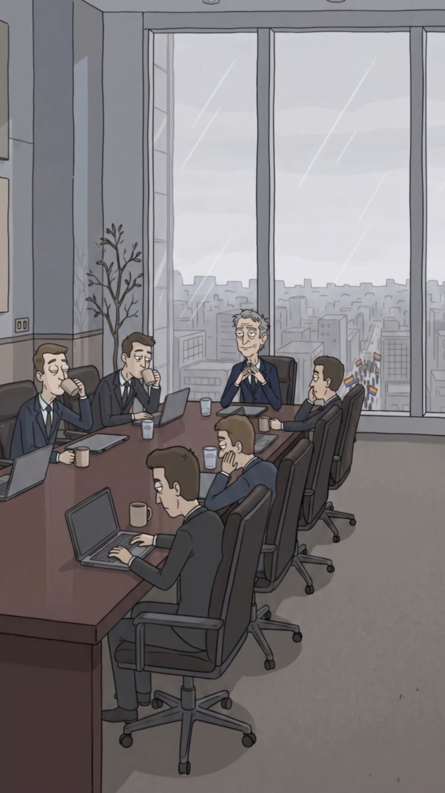

# Torre Blakrok

> **Tipo:** Corporativo  ·  **Estado:** 🟢 Canon (ya salió en un episodio)




## Descripción general
El edificio más alto y oscuro de Digitalia. Un monolito negro de vidrio que se ve desde cualquier parte de la ciudad, como un recordatorio de quién manda. Arriba, las letras **BLAKROK** en 3D, grises y enormes. Adentro, todo es silencio, café y decisiones que afectan a millones.

## Arquitectura y distribución
- **Exterior:** Torre rectangular de ~60 pisos con **fachada cuadriculada de vidrio negro** (`#2A2C33`) y marcos grises. En la cima, un **mirador acristalado** de doble altura y encima las **letras BLAKROK** en relieve gris plata con sombra. Rodeada de edificios de oficinas más bajos y grises.
- **Lobby:** Doble altura, piso de mármol negro, torniquetes con lector biométrico, y una **pantalla LED gigante** que muestra alertas ("Ciudadano no verificado" en rojo). Agentes de verificación en la entrada.
- **Sala de juntas (piso 58):** Sala rectangular con **mesa larga de madera rojiza pulida** (`#655150`) para 12, sillas ejecutivas de cuero café-negro con ruedas, **ventanal de piso a techo** en dos paredes con vista a toda la ciudad bajo la lluvia. Paredes gris-azulado con paneles de madera en la parte baja, un **árbol seco decorativo** en maceta en la esquina, cuadros abstractos beige.

## Utilería y detalles clave
Tazas de café beige frente a cada silla, laptops grises, vasos de agua, tablets. Una bandera arcoíris pequeña en la mesa (solo en junio). Enchufes metálicos en la pared. Desde la ventana, a lo lejos, se ven marchas con banderas diminutas.

## Estilo visual
- **Paleta:** vidrio `#2A2C33` · marcos `#4A4D55` · letras `#B9BBC0` · mesa `#655150` · sillas `#3A302E` · paredes `#8E949C` · cielo `#D2D4D9` · lluvia `#E4E7EB`.
- **Texturas:** Vidrio con reflejos del cielo en diagonal, madera pulida con reflejo de ventanas, alfombra gris lisa.
- **Iluminación:** **Luz fría y plana** del ventanal lluvioso; sin lámparas cálidas. De noche: la torre es una silueta negra con pocas ventanas encendidas y las letras iluminadas en blanco frío.
- **Clima:** Lluvia fina constante en los ventanales (gotas y líneas diagonales).
- **Atmósfera y sonido:** Silencio, lluvia contra el vidrio, sorbos de café, teclado.

## Encuadres recomendados
- Contrapicado desde la calle con la torre llenando el cuadro vertical.
- Plano general diagonal de la mesa con Larry en la cabecera frente al ventanal.
- Plano medio de Larry apoyado en la mesa con la ciudad a sus pies.

## Uso narrativo
El lugar donde se decide todo y donde se "compra" cada protesta. Todo giro de "al final era de Blakrok" termina aquí. Aparece en EP001 (pantalla) y EP003.

## Prompt de locación
```
towering black glass skyscraper with a grid facade and a glass-walled penthouse, huge grey 3D letters "BLAKROK" on top, surrounded by lower grey office buildings, overcast sky
```
**Interior (sala de juntas):**
```
corporate boardroom on a high floor, long polished reddish-brown wooden table for twelve, black leather executive chairs, grey coffee mugs and laptops on the table, floor-to-ceiling windows with rain streaks showing a vast grey city below, bluish-grey walls with lower wood panels, a bare decorative tree in a pot, cold flat daylight
```

## Quién aparece aquí
- ← [Blakrok](../../02-mundo/organizaciones.md#blakrok) `sede`
- ← [Larry Finque](../../03-personajes/el-capitalista/ficha.md) `frecuenta`
- ← [Los Socios](../../03-personajes/los-socios/ficha.md) `frecuenta`
- ← [Sebastián "Sebas" Luján](../../03-personajes/el-gay/ficha.md) `trabaja_en`

## Episodios
- [EP001 · Humano OFFLINE](../../06-episodios/EP001-humano-offline/README.md)
- [EP003 · ¡Abajo las corporaciones!](../../06-episodios/EP003-abajo-las-corporaciones/README.md)
