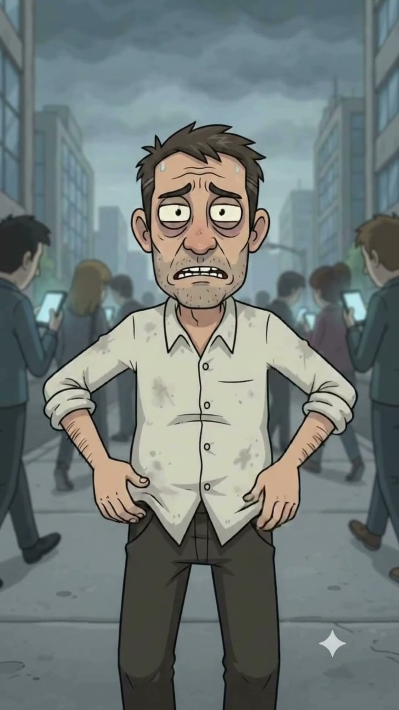
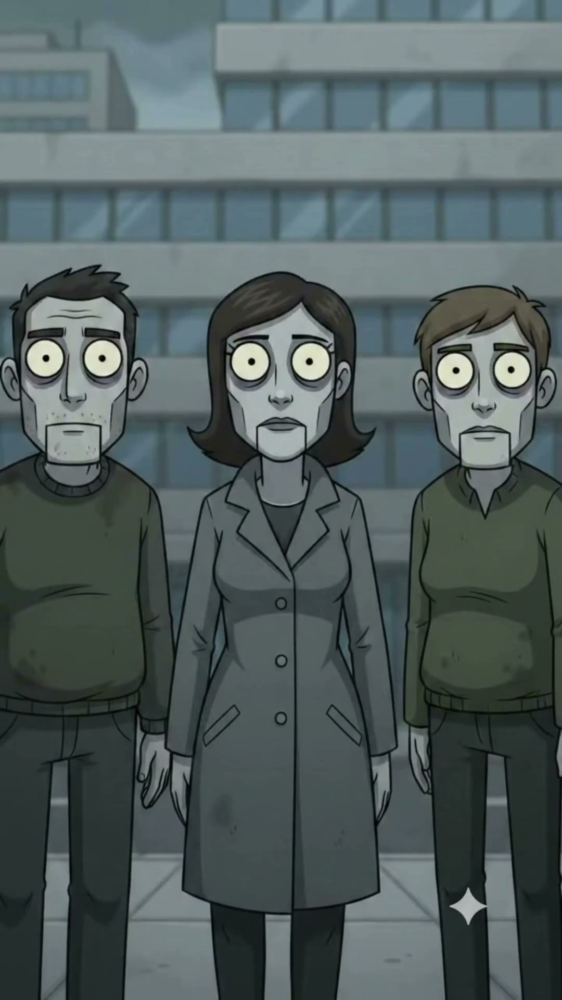
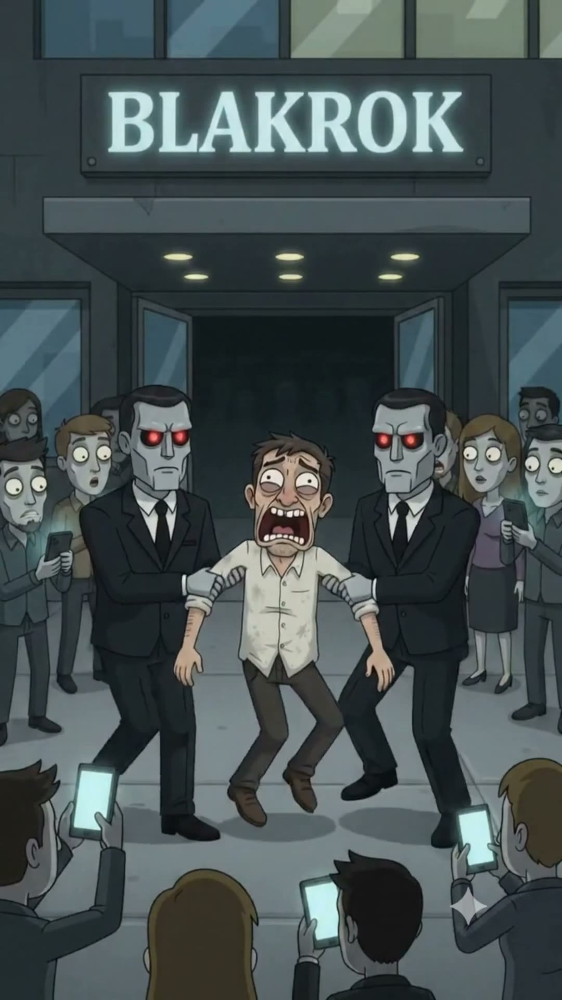

# EP001 · Humano OFFLINE

| | |
|---|---|
| **Estado** | ✅ Producido (versión final 24‑sep‑2026) |
| **Duración** | ~40 s |
| **Tema** | `vigilancia-datos`, `adiccion-digital` |
| **Protagonista** | [Rodrigo Nadie](../../03-personajes/el-humano-offline/ficha.md) |
| **Personajes** | [Zombis digitales](../../03-personajes/los-zombis-digitales/ficha.md), [Agentes de verificación](../../03-personajes/los-agentes/ficha.md) |
| **Locaciones** | [Plaza Central](../../04-locaciones/plaza-central/ficha.md), [Torre Blakrok](../../04-locaciones/torre-blakrok/ficha.md) (pantalla), [Parque Central](../../04-locaciones/parque-central/ficha.md) |
| **Publicado** | _(pegar links de TikTok / IG / YT)_ |

## La contradicción
En una ciudad donde existir = tener datos, el único humano libre y feliz es un criminal.

## Guion (reconstruido del video)
| # | Plano | Qué pasa | Audio / texto |
|---|---|---|---|
| 1 | Plano medio en la avenida | Rodrigo se toca los bolsillos: no tiene celular. | |
| 2 | Contraplano | Tres zombis digitales lo miran, grises, ojos vacíos. | "no existe" |
| 3 | General | La gente lo rodea y lo graba con el celular. | "no tengo redes" |
| 4 | Primer plano | Rodrigo suda, aterrado. | |
| 5 | Cenital | Círculo de zombis alrededor de él; pantalla de Blakrok: **"Ciudadano no verificado"**. | |
| 6 | General | Llegan los agentes de ojos rojos y se lo llevan frente a Blakrok. | "parte del sistema" |
| 7 | Banca del parque | Rodrigo, libre, con un helado. Sonríe con los ojos cerrados. | |
| 8 | Tarjeta | **"El último humano offline. En cines nunca, porque no tiene datos."** | |

## Fotogramas
     

## Archivos de producción (fuera del repo)
`Downloads\Juno Video\Homo Digitals\Humano OFFLINE\` — `Humano OFFLINE Final.mp4`, versión previa, voces ElevenLabs (`no existe.mp3`, `no tengo redes.mp3`, `parte del sistema.mp3`).

## Notas para próximos episodios
- Rodrigo puede volver: ¿cómo sobrevive sin datos? Aliado natural: Kevin (celular de tapa) en Chen's.
- La pantalla "Ciudadano no verificado" puede ser un gag recurrente.
