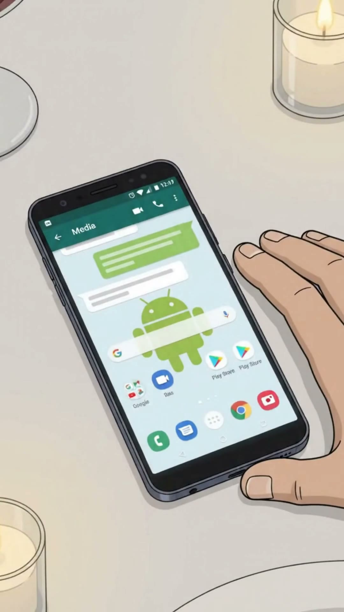
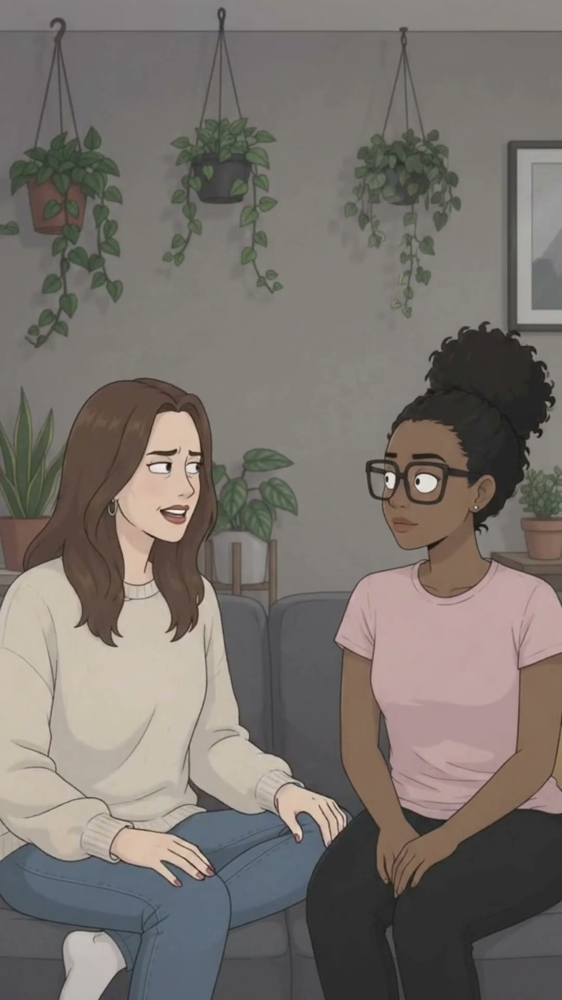
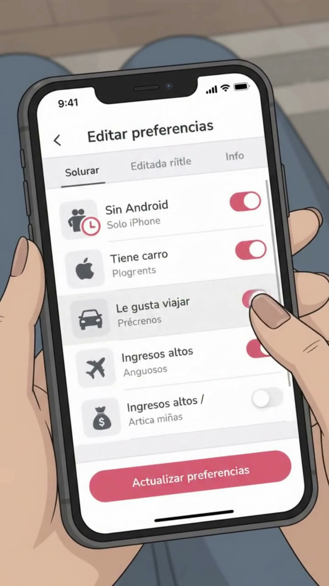

# EP002 · Red Flags Femeninas

| | |
|---|---|
| **Estado** | ✅ Producido (24‑sep‑2026) |
| **Duración** | ~35 s |
| **Tema** | `apps-de-citas` |
| **Protagonista** | [Valentina Ríos](../../03-personajes/la-mujer-empoderada/ficha.md) |
| **Personajes** | [Julián Moreno](../../03-personajes/el-buen-tipo/ficha.md), [Zuri Palacios](../../03-personajes/la-feminista/ficha.md) |
| **Locaciones** | [Restaurante La Terraza](../../04-locaciones/restaurante-la-terraza/ficha.md), [Apartamento de Valentina](../../04-locaciones/apartamento-de-valentina/ficha.md) |
| **Organización** | [Matchi](../../02-mundo/organizaciones.md#matchi) |
| **Publicado** | _(pegar links)_ |

## La contradicción
La cita perfecta se arruina por un detalle de consumo (un Android). Lo que ella llama "preferencias" es un filtro de producto.

## Guion (reconstruido del video)
| # | Plano | Qué pasa | Audio / texto |
|---|---|---|---|
| 1 | General restaurante | Julián y Valentina en una cita con vino y velas. Todo va bien. | "¿qué te gusta?" |
| 2 | Primer plano | Valentina, coqueta, mano en la mejilla. | |
| 3 | Detalle | El celular de Julián sobre la mesa: **Android**. | |
| 4 | Primer plano | Cara de asco de Valentina. | |
| 5 | General | Julián toma vino tranquilo; Valentina se tensa. | "dos años" / "cuando se dañe" |
| 6 | Sofá | Valentina le cuenta a Zuri, que escucha con cara de "¿en serio?". | |
| 7 | Celular | Valentina abre Matchi → **Editar preferencias**: *Sin Android (solo iPhone), Tiene carro, Le gusta viajar, Ingresos altos*. | "preferencias" |
| 8 | Remate | Notificación: **"La aplicación ha actualizado tus preferencias de pareja."** Valentina sonríe satisfecha. | |

## Fotogramas
      

## Archivos de producción (fuera del repo)
`Downloads\Juno Video\Homo Digitals\Red flags Femeninas\` — `Red flags FEMENINAS.mp4` (final), trims, clips de Gemini, voces (`que te gusta.mp3`, `dos años.mp3`, `cuando se dañe.mp3`, `preferencias.mp3`).

## Notas para balancear
Este episodio pica a las mujeres → hacer pronto la versión espejo: **"Red Flags Masculinas"** (ej. Brayan el gym bro que filtra por "que entrene y no pida nada"). Ver [banco de ideas](../../08-ideas/banco-de-ideas.md).
