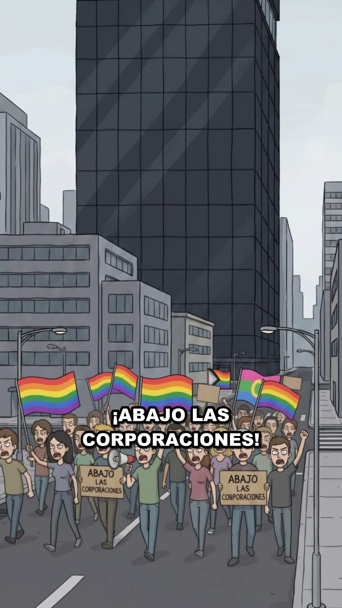
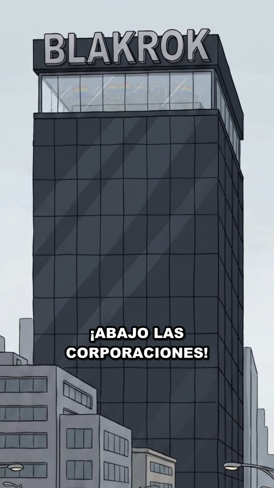
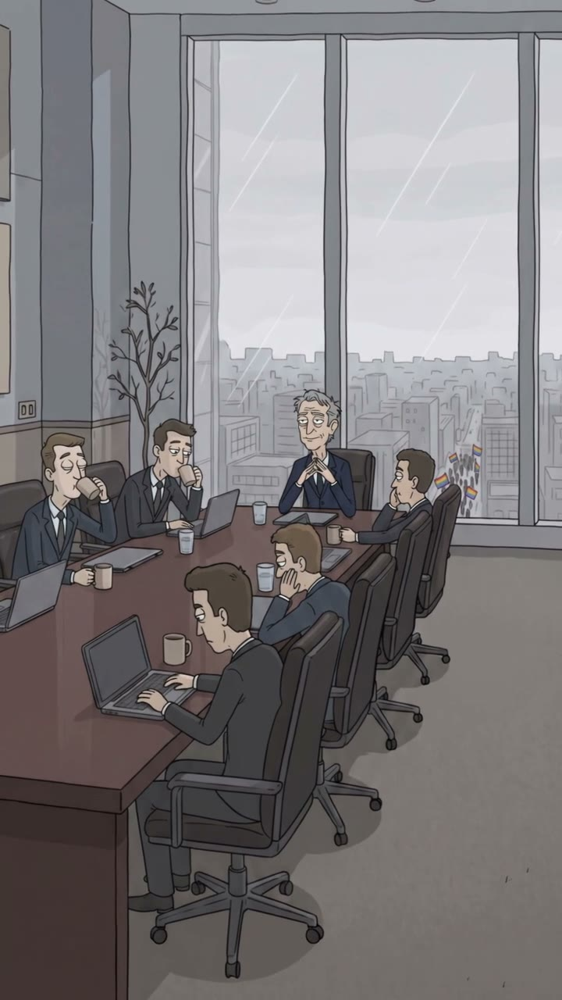
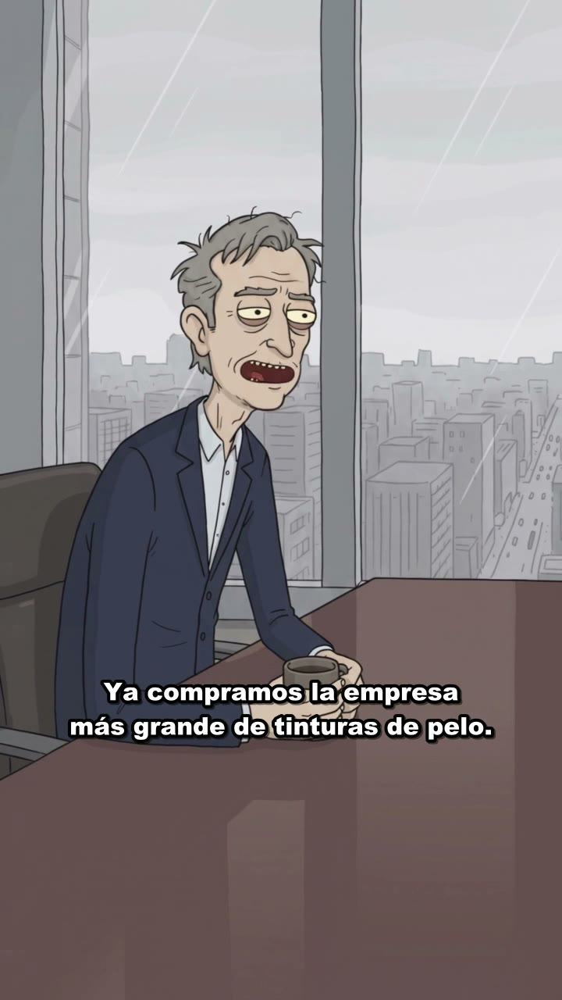
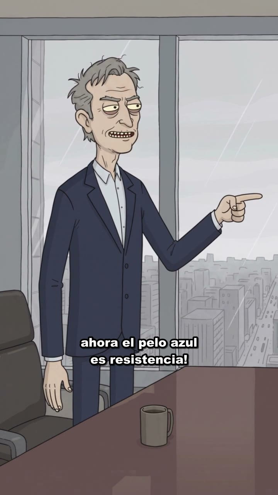
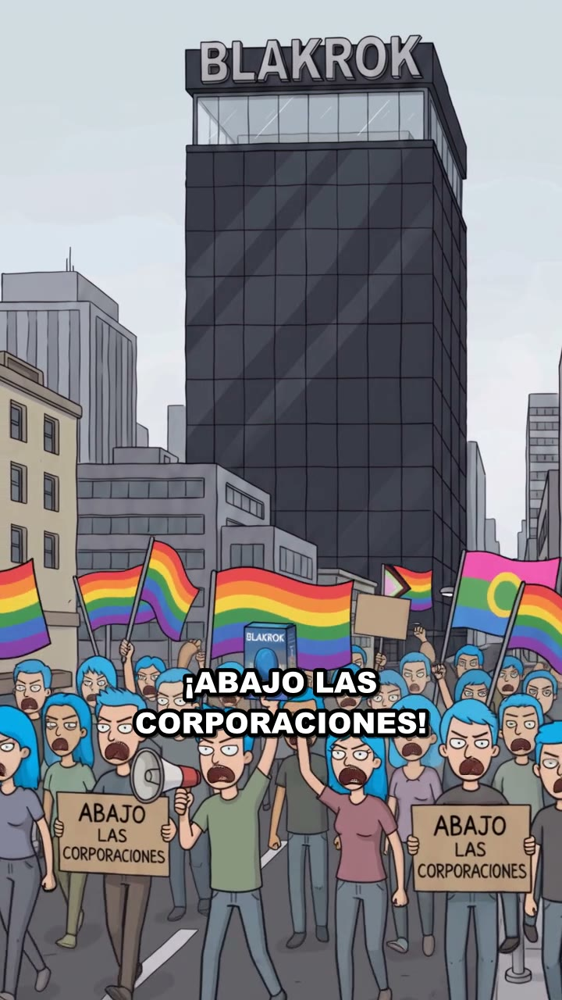

# EP003 · ¡Abajo las corporaciones!

| | |
|---|---|
| **Estado** | ✅ Producido (25‑sep‑2026) |
| **Duración** | ~25 s |
| **Tema** | `corporaciones-absorben-protesta`, `activismo-performativo` |
| **Protagonista** | [Larry Finque](../../03-personajes/el-capitalista/ficha.md) |
| **Personajes** | [Manifestantes](../../03-personajes/los-manifestantes/ficha.md), [Los Socios](../../03-personajes/los-socios/ficha.md) |
| **Locaciones** | [Plaza Central](../../04-locaciones/plaza-central/ficha.md), [Torre Blakrok](../../04-locaciones/torre-blakrok/ficha.md) |
| **Publicado** | _(pegar links)_ |

## La contradicción
La protesta contra la corporación se convierte en un producto de la corporación.

## Guion (reconstruido del video)
| # | Plano | Qué pasa | Texto |
|---|---|---|---|
| 1 | General avenida | Marcha con banderas arcoíris y pancartas frente a la torre. | **¡ABAJO LAS CORPORACIONES!** |
| 2 | Contrapicado | La torre BLAKROK, imponente. | **¡ABAJO LAS CORPORACIONES!** |
| 3 | Sala de juntas | Los Socios toman café; Larry preside, tranquilo. | |
| 4 | Plano medio | Larry, taza en mano, sonríe. | "Ya compramos la empresa más grande de tinturas de pelo." |
| 5 | Plano medio | Larry se levanta y se abotona el saco. | "¡Inicien la campaña de marketing:" |
| 6 | Plano medio | Señala a la ventana. | "ahora el pelo azul es resistencia!" |
| 7 | Remate | La marcha de nuevo: **todos con pelo azul**, gritando lo mismo. | **¡ABAJO LAS CORPORACIONES!** |

## Fotogramas
     

## Archivos de producción (fuera del repo)
`Downloads\Juno Video\Homo Digitals\Abajo las corporaciones.mp4`

## Continuidad
- Desde este episodio, **Blakrok es dueña de la tintura azul**. Los manifestantes y Nico mantienen el pelo azul.
- Retcon sugerido: la campaña la diseñó Sebas (community manager de Blakrok).
