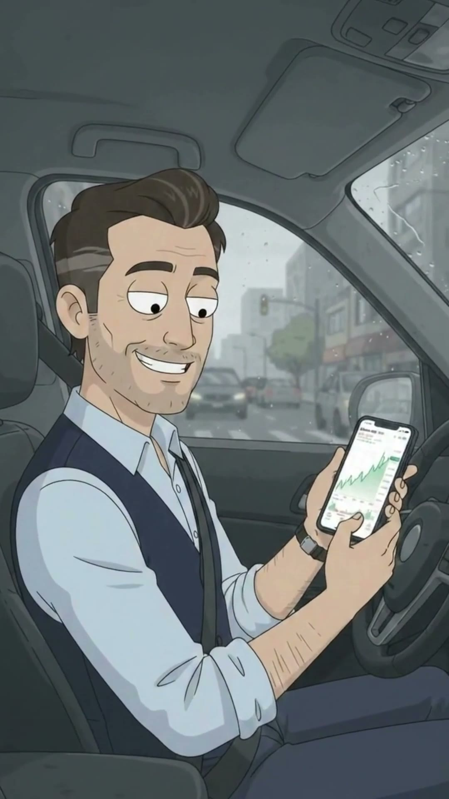
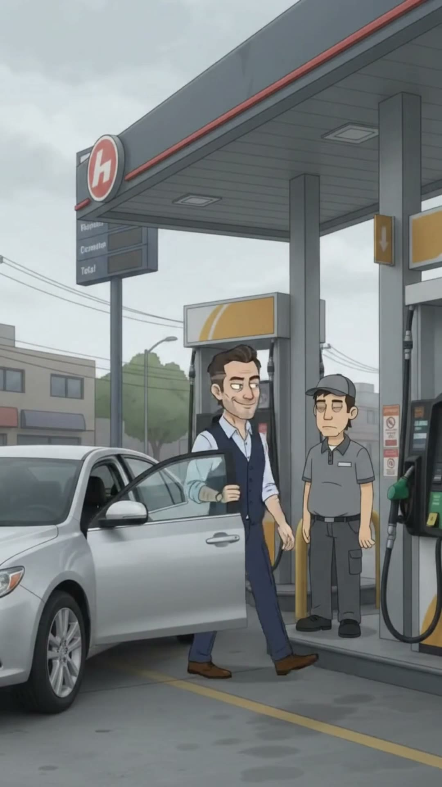
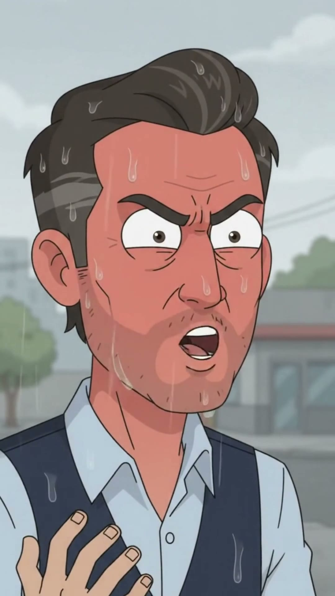
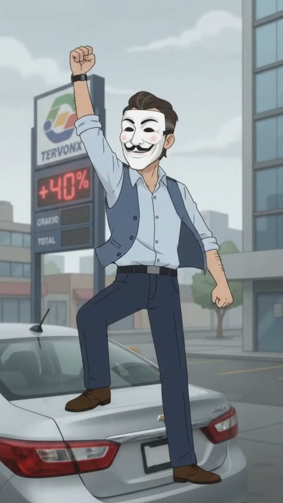
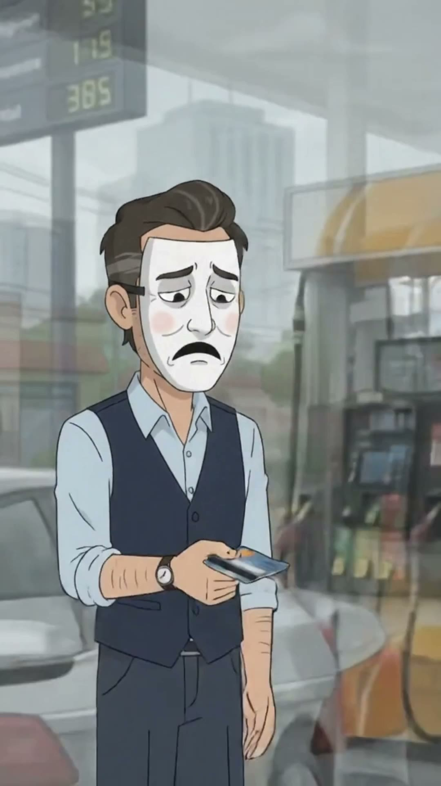

# EP004 · El capital es bueno hasta que…

| | |
|---|---|
| **Estado** | ✅ Producido (25‑sep‑2026) |
| **Duración** | ~40 s |
| **Tema** | `capitalismo-de-conveniencia` |
| **Protagonista** | [Andrés "El Bull" Rentería](../../03-personajes/el-inversionista/ficha.md) |
| **Personajes** | [Jhon Fredy](../../03-personajes/el-bombero/ficha.md) |
| **Locaciones** | [Gasolinera Tervonx](../../04-locaciones/gasolinera-tervonx/ficha.md) |
| **Publicado** | _(pegar links)_ |

## La contradicción
El que celebra que suben sus acciones de la petrolera se vuelve anticapitalista cuando le cobran la gasolina… y paga igual.

## Guion (reconstruido del video)
| # | Plano | Qué pasa |
|---|---|---|
| 1 | Interior carro | Andrés sonríe mirando su app: las acciones de Tervonx suben. Se lo presume a cámara. |
| 2 | General gasolinera | Llega a tanquear; Jhon Fredy lo atiende. |
| 3 | Letrero | Precio de la gasolina: **+40 %**. |
| 4 | Plano medio | Jhon Fredy, impasible. |
| 5 | Primer plano | Andrés se pone **rojo de furia**. |
| 6 | Baúl | Saca una máscara de Guy Fawkes. |
| 7 | General | Se sube al carro con el puño en alto, anticapitalista. |
| 8 | Remate | Con la máscara (ahora **triste**), saca la billetera y paga. |

## Fotogramas
     

## Archivos de producción (fuera del repo)
`Downloads\Juno Video\Homo Digitals\El capital es bueno hasta que.mp4`

## Continuidad
- Andrés guarda la máscara en el baúl: puede reaparecer cada vez que algo le toque el bolsillo.
- Jhon Fredy es el testigo mudo ideal para cameos en cualquier episodio de clase media.
