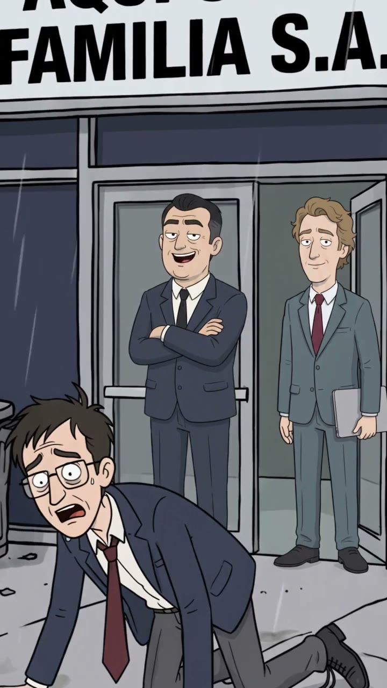
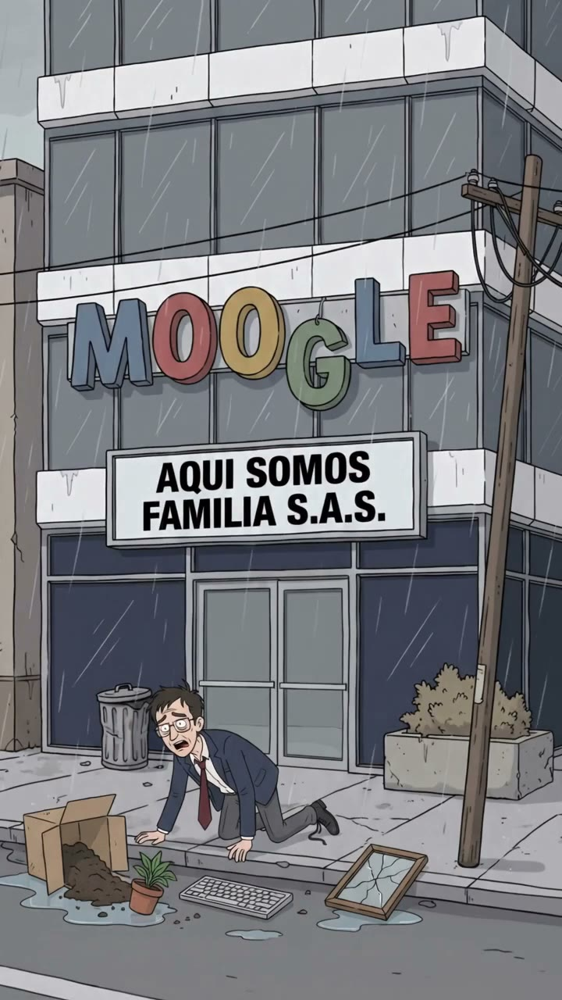
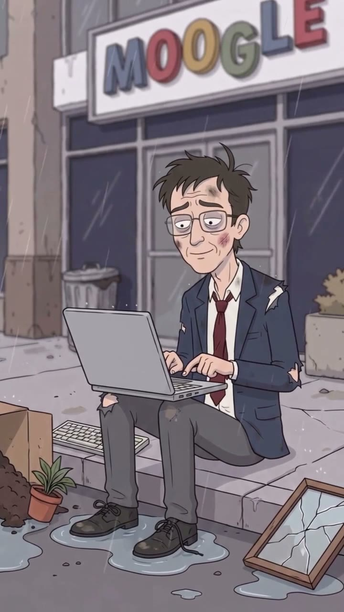
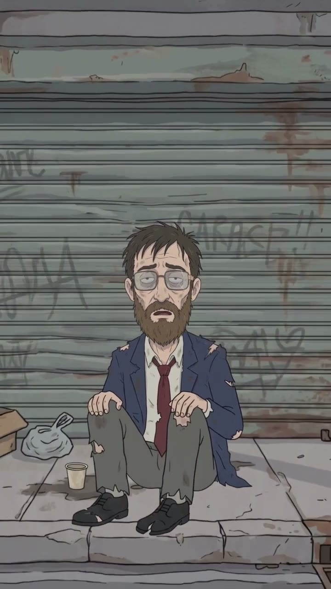

# EP005 · Nuevos retos

| | |
|---|---|
| **Estado** | ✅ Producido (27‑sep‑2026) |
| **Duración** | ~31 s |
| **Tema** | `cultura-corporativa`, `ia-automatizacion` |
| **Protagonista** | [Wilson Pérez](../../03-personajes/el-asalariado/ficha.md) |
| **Personajes** | [Mauricio Sinergia](../../03-personajes/el-empresario/ficha.md) (el de brazos cruzados) |
| **Locaciones** | [Oficinas de Moogle](../../04-locaciones/oficinas-moogle/ficha.md) |
| **Publicado** | _(pegar links)_ |

## La contradicción
"Aquí somos familia"… y te sacan a la calle. Y aun así, el despedido publica en LinkedIn que está emocionado por sus "nuevos retos".

## Guion (reconstruido del video)
| # | Plano | Qué pasa |
|---|---|---|
| 1 | Puerta de Moogle | Wilson cae al andén, echado. Mauricio (brazos cruzados) y otro ejecutivo sonríen. Letrero: **AQUÍ SOMOS FAMILIA S.A.S.** |
| 2 | General | Los ejecutivos entran; Wilson en el piso bajo la lluvia, con su caja. |
| 3 | Primer plano | Wilson golpeado, se acomoda las gafas. |
| 4 | POV | Abre la laptop sobre las rodillas. |
| 5 | Plano medio | Sentado en el andén, sonríe y escribe su post: "emocionado por nuevos retos". |
| 6 | Remate | Tiempo después: Wilson con barba larga, indigente, frente a una persiana grafiteada. |

## Fotogramas
   

## Archivos de producción (fuera del repo)
`Downloads\Juno Video\Homo Digitals\Nuevos retos.mp4`

## Continuidad
- Retcon sugerido: a Wilson lo reemplazó un robot Unidad de Xpacio.
- Wilson puede reaparecer de fondo en la calle, siempre con la laptop y siempre positivo.
