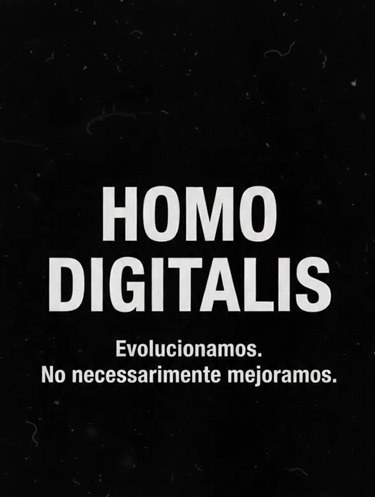

# Homo Digitalis TV

**Evolucionamos. No necesariamente mejoramos.**

Base de conocimiento de **Homo Digitalis**: videos cortos animados de sátira sobre el mundo actual y la tecnología, ambientados en una misma ciudad, **Digitalia**, con personajes y lugares recurrentes.

Aquí vive todo lo necesario para crear contenido consistente: marca, estilo visual, mundo, personajes, locaciones, el grafo que los conecta y los episodios producidos. **Los videos y audios no van en el repo**; solo texto e imágenes.

## Mapa del repo
| Carpeta | Contenido |
|---|---|
| [`00-marca/`](00-marca/README.md) | Quiénes somos, lema, logo, **tono y reglas de sátira** |
| [`01-estilo-visual/`](01-estilo-visual/README.md) | Dibujo, **paleta**, iluminación, animación, tipografía, **prompts base** |
| [`02-mundo/`](02-mundo/README.md) | La ciudad de Digitalia, sus reglas, organizaciones parodia (Blakrok, Moogle, Xpacio…) y temas |
| [`03-personajes/`](03-personajes/README.md) | Una carpeta por personaje: `ficha.md` + `imagenes/` |
| [`04-locaciones/`](04-locaciones/README.md) | Una carpeta por lugar: `ficha.md` + `imagenes/` |
| [`05-grafo/`](05-grafo/README.md) | **Grafo** personajes ↔ lugares ↔ organizaciones ↔ temas ↔ episodios. Abre `grafo.html` |
| [`06-episodios/`](06-episodios/README.md) | Un README por episodio con guion plano a plano + fotogramas |
| [`07-plantillas/`](07-plantillas/) | Plantillas de ficha de personaje, locación y guion |
| [`08-ideas/`](08-ideas/banco-de-ideas.md) | Banco de ideas para próximos episodios |

## Flujo para crear un episodio
1. Elige una idea del [banco](08-ideas/banco-de-ideas.md) o un tema sin cubrir en el [grafo](05-grafo/grafo.html).
2. Revisa las [reglas de sátira](00-marca/tono-y-reglas-de-satira.md).
3. Copia la [plantilla de guion](07-plantillas/guion-episodio.md) a `06-episodios/EPxxx-slug/README.md`.
4. Genera imágenes con [prompt base](01-estilo-visual/prompts-base.md) + prompt del personaje + prompt de la locación, **adjuntando las imágenes de referencia** de sus carpetas.
5. Anima, pon voces, edita (ver [producción](01-estilo-visual/animacion-y-produccion.md)).
6. Guarda fotogramas, actualiza el grafo (`node 05-grafo/build.mjs`) y las fichas.

## Convenciones
- **Nombres de carpetas y archivos:** minúsculas, sin tildes, con guiones: `el-capitalista`, `torre-blakrok`, `larry-finque-sala-de-juntas.jpg`.
- **Imágenes:** `.jpg`, descriptivas. Hoja de personaje: `<slug>__hoja-de-personaje.jpg`.
- **Estados:** 🟢 canon (salió en un episodio) · 🟡 diseñado (tiene imagen) · ⚪ propuesto.
- **Relaciones:** se editan en `05-grafo/grafo.json` (fuente de verdad).
